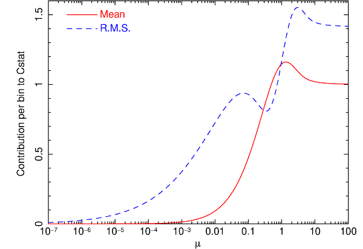

.. _sec:fit:

Fit: spectral fitting
=====================

Overview
~~~~~~~~

With this command one fits the spectral model to the data. Only
parameters that are thawn are changed during the fitting process.
Options allow you to do a weighted fit (according to the model or the
data), have the fit parameters and plot printed and updated during the
fit, and limit the number of iterations done. 

Fit methods
~~~~~~~~~~~

There are three methods implemented that can provide the best fit. All these 
methods are described in detail in the book of `Press et al. (Numerical Recipes)
<http://numerical.recipes/>`_. We refer to that book for more details (our
algorithms, however, are taken from other sources).

The main and default algorithm is the Levenberg-Marquardt minimisation algorithm.
This is recommended for most cases, but it takes advantage of functions with 
continuous derivatives with respect to the parameters. Also, it will not always
find the true minimum, unless the initial values are chosen with care. For those
cases, we have as alternatives the simplex method and the simulated annealing
method. Both methods are better suited to obtain the true minimum in case of
multiple minima, but again here choice of initial parameters is important, and 
there is no guarantee that the true minimum is reached. In addition, they require
significantly more function evaluations compared with the Levenberg-Marquardt
algorithm. It is advised to turn back to the Levenberg-Marquardt method when
error search is done.

Simulated annealing details
~~~~~~~~~~~~~~~~~~~~~~~~~~~

It is beyond the scope of this paper to describe the method in detail. 
More can be found in the Numerical Recipes book mentioned above, and for our
implementation in `Goffe et al. (1994)
<https://econpapers.repec.org/RePEc:eee:econom:v:60:y:1994:i:1-2:p:65-99>`_.
The method basically moves step by step from one set
of parameters to another, accepting always better solutions but every now and
then accepting poorer solutions (to get out of sub-minima). The degree to which
poorer solutions are accepted depends on the Metropolis criterion. During the
process, a fake temperature is slowly decreased, until the absolute minimum is
reached. This temperature should NOT be confused with the true temperature in
case the spectral model contains plasma components. The default parameters
should work, but several other parameters can be modified when needed.
Important here are the start temperature :math:`T`, the relative temperature
decrease :math:`RT` after each set of iterations, the stop criterion 
:math:`\epsilon`, the step size scaling factor :math:`vm`, 
the scaling for the number of function evaluations at each temperature
:math:`ns`, the maximum number of function evaluations :math:`max`, and a 
flag controlling the printing of intermediate results.

Fit statistic
~~~~~~~~~~~~~

At the moment SPEX uses two types of fit statistic, :math:`\chi^2` and
C-stat. We first treat the :math:`\chi^2` statistic, because
historically that has been most widely used. However, in the present
version of SPEX  C-stat is the default because in the far majority of
the cases it gives more robust results. Both statistics can be used for all
of the fitting methods.

Chi-squared fitting
~~~~~~~~~~~~~~~~~~~

First we make a few remarks about proper data weighting. :math:`\chi^2`
is usually calculated as the sum over all data bins :math:`i` of
:math:`(N_i - s_i)^2 / \sigma_i^2`, i.e.

.. math:: \chi^2 = \sum_{i=1}^{n} \frac{(N_i - s_i)^2}{\sigma_i^2},

where :math:`N_i` is the observed number of source plus background
counts, :math:`s_i` the expected number of source plus background counts
of the fitted model, and for Poissonian statistics usually one takes
:math:`\sigma_i^2=N_i`. Take care that the spectral bins contain
sufficient counts (either source or background), recommended is e.g. to
use at least :math:`\sim 10` counts per bin. If this is not the case,
first rebin the data set whenever you have a "continuum" spectrum. For
line spectra you cannot do this of course without loosing important
information! Note however that this method has inaccuracies if
:math:`N_i` is less than :math:`\sim 100`.

`Wheaton et al. (1995) <https://ui.adsabs.harvard.edu/abs/1995ApJ...438..322W/abstract>`_
have shown that the classical :math:`\chi^2` method becomes inaccurate
for spectra with less than :math:`\sim 100` counts per bin. This is *not*
due to the approximation of the Poisson statistic by a normal distribution,
but due to using the *observed* number of counts :math:`N_i` as weights
in the calculation of :math:`\chi^2`. `Wheaton et al. (1995)
<https://ui.adsabs.harvard.edu/abs/1995ApJ...438..322W/abstract>`_
showed that the problem can be resolved by using instead
:math:`\sigma_i^2 = s_i`, i.e. the *expected* number of counts
from the best fit model.

The option "fit weight model" allows to use these modified weights. By
selecting it, the expected number of counts (both source plus
background) of the current spectral model is used onwards in calculating
the fit statistic. `Wheaton et al. (1995) <https://ui.adsabs.harvard.edu/abs/1995ApJ...438..322W/abstract>`_
suggest to do the following 3-step process, which we also recommend to the user of
SPEX who uses this option:

#. first fit the spectrum using the data errors as weights (the default
   of SPEX).

#. After completing this fit, select the "fit weight model" option and
   do again a fit

#. then repeat this step once more by again selecting "fit weight model"
   in order to replace :math:`s_i` of the first step by :math:`s_i` of
   the second step in the weights. The result should now have been
   converged (under the assumption that the fitted model gives a
   reasonable description of the data, if your spectral model is way off
   you are in trouble anyway!).

C-stat
~~~~~~

There is yet another option to try for spectral fitting with low count
rate statistics and that is maximum likelyhood fitting. It can be shown
that a good alternative to :math:`\chi^2` in that limit is

.. math:: C = 2 \sum_{i=1}^{n} s_i - N_i + N_i \ln (N_i/s_i).

This is strictly valid in the limit of Poissonian statistics. If you
have a background subtracted spectrum, take care that the subtracted
number of background counts is properly stored in the spectral data
file, so that raw number of counts can be reconstructed.

This statistic was originally proposed in some other form by
`Cash (1979) <https://ui.adsabs.harvard.edu/abs/1979ApJ...228..939C/abstract>`_
and in the present form sometimes attributed to Castor. However, it appears
that it was already introduced and well explained by
`Baker et al. (1994) <https://ui.adsabs.harvard.edu/abs/1984NIMPR.221..437B/abstract>`_ .

.. warning:: Note that for a spectrum with many counts per bin
   :math:`C\rightarrow\chi^2`, but if the predicted number of counts per
   bin is small, the expected value for :math:`C` can be substantially
   smaller than the number of bins :math:`n`.

To help the user to see if a :math:`C`-value corresponds to an
acceptable fit, SPEX gives, after spectral fitting, the expected value
of :math:`C` and its r.m.s. spread, based on the best-fit model. Both
quantities are simply determined by adding the expected contributions
and their variances over all bins. See `Kaastra et al. (2017)
<https://ui.adsabs.harvard.edu/abs/2017A&A...605A..51K/abstract>`_
for more details.

   Expected value of the contribution per bin to :math:`C`, and its
   r.m.s. uncertainty, as a function of the mean expected number of
   counts :math:`\mu`.

The expected value :math:`C_{\rm e}` for :math:`C` in a bin :math:`i`
and its variance :math:`C_{\rm v}` are given by:

.. math:: C_{e} = 2 \sum_{k=0}^\infty P_k(\mu) (\mu - k + k \ln (k/\mu)),

.. math:: S_{v} = 4 \sum_{k=0}^\infty P_k(\mu) (\mu - k + k \ln (k/\mu))^2,

.. math:: C_{v} = S_{v} - C_{e}^2,

with :math:`P_k(\mu)` the Poisson distribution:

.. math:: P_k(\mu) = {e}^{\displaystyle{-\mu}} \mu^k / k!

and :math:`\mu` the expected number of counts. We show both quantities
in Fig. \ `1 <#fig:cstat>`__.

.. warning:: For a proper use of C-stat, it is needed that the
   background (if present) is also a model for the background, not a scaled
   background observation. Unfortunately, the fast majority of instrument
   software packeges provide spectra with such a scaled (and therefore
   noisy) background). By experimenting it can be shown that in situations
   where the source is (much) weaker that the subtracted background, this
   can give bias in the fitted flux (it will be over-estimated). Rebinning
   the spectrum resolves the problem (because it is some kind of smoothing)
   but at the expense of spectral resolution. This is undesired. We
   therefore offer an auxiliary program called backfilter that can filter
   the subtracted background. It works on a .spo file and creates an
   improved .spo file. See the documentation of backfilter for more
   details.

W-stat
~~~~~~

The above problem is mitigated in the Xspec package by introducing the
so-called W-statistic. See the Xspec manual for more details. We provide
here the option to fit using W-stat for compatibility reasons,

.. warning:: But we do not recommend to use it, but instead use C-stat
   with background filtering (see above) where needed.

The W-stat first calculates a background estimate for each bin using
maximum likelihood techniques. This background depends on the number of
counts in the background region, the number of counts in the source
region, the predicted number of source counts from the spectral model,
and the exposure times of the source region and background region (or,
equivalently, incorporating any background area scaling ratio). Using
these background estimates, W-stat is then evaluated, and this can be
used in the algorithm to find the best-fit set of source parameters.

The Xspec manual notes that for weak sources it can generate an
obviously wrong best fit", and they advice to rebin to at least one
count per bin to mitigate. This however may degrade the spectral
resolution too much. Moreover, for a simple case (blackbody fit to an
isolated neutron star), we found that the fitting procedure can show
non-monotonous behaviour of W-stat versus iteration, with annoying
oscillatory behaviour. Also, a full fit with error search of that
spectrum required four times more model evaluations compared with C-stat
fitting with filtered background.

Syntax
~~~~~~

The following syntax rules apply:

| ``fit`` : Execute a spectral fit to the data.
| ``fit print #i`` : Printing the intermediate results during the
  fitting to the screen for every :math:`n`-th step, with :math:`n`\ =#i
  (most useful for :math:`n=1`). Default value: 0 which implies no
  printing of intermediate steps.
| ``fit iter #i`` : Stop the fitting process after #i iterations,
  regardless convergence or not. This is useful to get a first
  impression for very cpu-intensive models. To return to the default
  stop criterion, type fit iter 0.
| ``fit weight model`` : Use the current spectral model as a basis for
  the statistical weight in all subsequent spectral fitting.
| ``fit weight data`` : Use the errors in the spectral data file as a
  basis for the statistical weight in all subsequent spectral fitting.
  This is the default at the start of SPEX.
| ``fit statistic chi2`` : Use the :math:`\chi^2` statistic for the
  minimisation.
| ``fit statistic cstat`` : Use the C-statistics for the minimisation.
  This is the default at start-up.
| ``fit statistic wstat`` : Use the W-statistics for the minimisation.
| ``fit method classical`` : Use the classical Levenberg-Marquardt
  minimisation as the fitting method.
| ``fit method simplex`` : Use simplex
  minimisation as the fitting method.
| ``fit method anneal`` : Use simulated annealing
  minimisation as the fitting method.
| ``fit ann rt #r`` : Change the temperature reduction factor. Default value is
  0.85.
| ``fit ann t #r`` : Change the start temperature. Default value: 5.
| ``fit ann eps #r`` : Change the convergence criterion :math:`\epsilon`. 
  If the final function values from the last 4 temperatures differ from the
  corresponding value at the current temperature by less than
  :math:`\epsilon` and the final function value at the current temperature
  differs from the current optimal function value by less than
  :math:`\epsilon`, execution terminates. Default value is 0.10. 
| ``fit ann vm #r`` : The step length vector. On input it should encompass 
   the region of interest given the starting value X.  For point X(I), the next
   trial point is selected is from X(I) - VM(I)  to  X(I) + VM(I).
   Since VM is adjusted so that about half of all points are accepted,
   the input value is not very important (i.e. if the value is off,
   the algorithm adjusts VM to the correct value). Default value: 1.
| ``fit ann ns #i`` : Number of cycles.  After :math:`ns*n` function 
  evaluations, where :math:`n` is the number of free parameters, each element of
  the vector VM is adjusted so that approximately half of all function 
  evaluations are accepted. The vector VM controls the relative step size for the
  free parameters. Default value for :math:`ns` is 20.
| ``fit ann max #i`` : The maximum number of function evaluations. If during
  iteration more than this maximum nunber of evaluations is used, the process
  terminates with an error message (not converged). Default value: 100000.
| ``fit ann print #r`` : Controls the printing of details of th simulated
  annealing process during the fit. Allowed values 0 to 3. Only relevant for
  debugging your problem, may give a lot of output depending on its value.
  Default value: 0 (no printing). This is overruled by the fit print ...
  command, which for the simulated annealing method prints every new set of
  parameters and plots its spectrum if a new minimum is found.

Examples
~~~~~~~~

| ``fit`` : Performs a spectral fit. At the end the list of best fit
  parameters is printed, and if there is a plot this will be updated.
| ``fit print 1`` : If followed by the above fit command, the
  intermediate fit results are printed to the screen, and the plot of
  spectrum, model or residuals is updated (provided a plot is selected).
| ``fit iter 10`` : Stop the after 10 iterations or earlier if
  convergence is reached before ten iterations are completed.
| ``fit iter 0`` : Stop fitting only after full convergence (default).
| ``fit weight model`` : Instead of using the data for the statistical
  weights in the fit, use the current model.
| ``fit weight data`` : Use the data instead for the statistical weights
  in the fit.
| ``fit method clas`` : Use the classical Leveberg-Marquardt method to
  find minima.
| ``fit ann rt 0.5`` : changes the temperature reduction factor for simulated
  annealing to 0.5.
| ``fit statistic chi2`` : Switch from C-statistics to :math:`\chi^2`.
| ``fit statistic cstat`` : Switch back to C-statistics.
