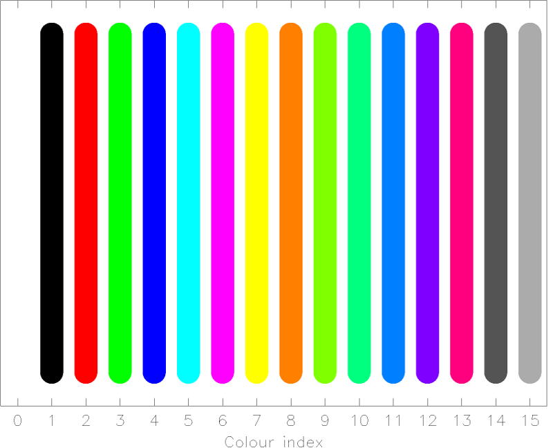

.. _sect:plotcolours:

Plot colours
============

The table below lists the plot colours that are available.

===== ==================
Value Colour
===== ==================
00    Black (background)
01    White (default)
02    Red
03    Green
04    Blue
05    Cyan (Green + Blue)
06    Magenta (Red + Blue)
07    Yellow (Red + Green)
08    Orange (Red + Yellow)
09    Green + Yellow
10    Green + Cyan
11    Blue + Cyan
12    Blue + Magenta
13    Red + Magenta
14    Dark Grey
15    Light Gray
===== ==================

.. _label: fig:plotcolours

