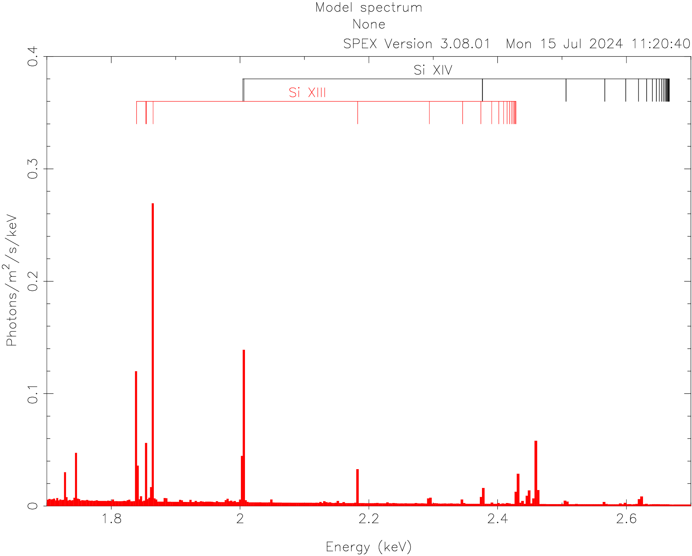

.. _sect:plotion:

Plot line labels
================

Since SPEX 3.08.01, we have a command to show labels for the strongest lines for an ion.
The labels can be added per ion of an element.

Example
-------

In the figure below, we add line labels for Si XIII and Si XIV on top of a CIE model spectrum using the following
SPEX commands::

    # First set the model and create the plot
    com cie
    var calc qc
    calc
    plot dev xs
    plot type model
    plot y lin
    plot rx 1.7:2.7
    plot ry 0.0:0.4
    plot

    # Add the line labels
    plot ion new 14 14
    plot ion new 14 13
    plot

    # See the result in the figure below

    # Delete the line labels
    plot ion del

