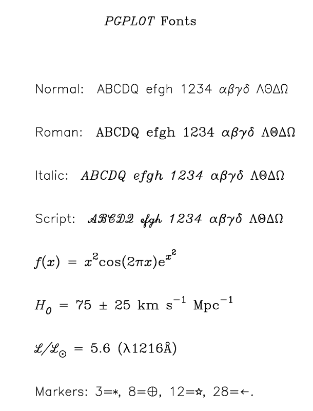

.. _sect:plottext:

Plot text
=========

In  it is possible to draw text strings on the plot surface or near the
frame of the plot. Several properties of the text can be adjusted, like
the fontheight, font type, colour, orientation and location of the text.
See the figure below for an example of possible fonts.

Font types (font)
-----------------

The following fonts types are allowed (values between 1–4):

#. normal font (default)

#. roman font

#. *italic font*

#. script font

   Example of different fonts.

Font heights (fh)
-----------------

The font height can be entered as a real number, the default value is 1.
A useful value for getting results that are still readable for
publications is 1.3. Note that if you make the font height for the
captions of the figure too large, you may loose some text off the paper.

Special characters
------------------

The texts strings that are plotted may be modified using the pgplot
escape sequences. These are character–sequences that are not plotted,
but are interpreted as instructions to change the font, draw
superscripts or subscripts, draw non-ASCII characters, Greek letters,
etc. All escape sequences start with a backslash character (``\``). A
list of the defined escape sequences is given in the first table below. A
lookup table for Greek letters is presented in the table after that. Some
useful non-ASCII characters are listed as well.
The last table shows some examples of the use of pgplot escape
sequences in character strings.

**A list of available escape sequences.**

======== ==============================================================================
Seq.     Description
======== ==============================================================================
``\u``   Start a superscript or end a subscript. A ``\u`` must be ended by a ``\d``!
``\d``   Start a subscript or end a superscript. A ``\d`` must be ended by a ``\u``!
``\\``   Backspace (i.e. do not advance textpointer after plotting the previous character)
``\A``   Ångstrom symbol (Å)
``\gx``  Greek letter corresponding to roman letter ``x``
``\fn``  Switch to Normal font
``\fr``  Switch to Roman font
``\fi``  Switch to Italic font
``\fs``  Switch to Script font
``\(n)`` Character number :math:`n`, see *pgplot manual appendix B, tab. 1*
======== ==============================================================================

** List of upper- and lower case Greek letters (G) and their corresponding Roman letters (R).**

.. math::

   \begin{array}{rc|c|c|c|c|c|c|c|c|c|c|c|c|c|c|c|c|c|c|c|c|c|c|c}
   \hline \hline
   {\rm R:} & A & B & G & D & E & Z & Y & H & I & K & L & M & N & C & O & P & R & S & T & U & F & X & Q & W \\
   {\rm G:} & A & B & \Gamma & \Delta & E & Z & H & \Theta & I & K & \Lambda & M & N & \Xi & O & \Pi & P & \Sigma & T & \Upsilon & \Phi & X & \Psi & \Omega\\
   \hline
   {\rm R:} & a & b & g & d & e & z & y & h & i & k & l & m & n & c & o & p & r & s & t & u & f & x & q & w\\
   {\rm G:} & \alpha & \beta & \gamma & \delta & \epsilon & \zeta & \eta & \theta & \iota & \kappa & \lambda & \mu & \nu & \xi & o & \pi & \rho & \sigma & \tau & v & \phi & \chi & \psi & \omega\\
   \hline \hline
   \end{array}

.. math::

   \begin{array}{cc|cc|cc}
   \hline\hline
   \sim            & 2248 & \pm      & 2233 & \nabla   & 0583 \\
   \approx         & 0248 & \mp      & 2234 & \surd    & 2267 \\
   \cong           & 0250 & \times   & 2235 & \int     & 2268 \\
   \propto         & 2245 & \div     & 2237 & \oint    & 2269 \\
   \neq            & 2239 & \equiv   & 2240 & \infty   & 2270 \\
   \stackrel{<}{=} & 2243 & \dagger  & 2277 & \partial & 2286 \\
   \stackrel{>}{=} & 2244 & \ddagger & 2278 & \odot    & 2281 \\
   \hline\hline
   \end{array}

+------------------------------------------------------------------------+--------------------------------------------------------+
| **Displayed**                                                          | **PGPLOT escape sequence**                             |
+------------------------------------------------------------------------+--------------------------------------------------------+
| :math:`f(x) = x^2\cos (2\pi x)`                                        | ``\fif(x) = x\u2\d \frcos\fi(\fr2\fi\gpx)``            |
+------------------------------------------------------------------------+--------------------------------------------------------+
| :math:`H_0` = 75 :math:`\pm` 25 km s\ :math:`^{-1}` Mpc\ :math:`^{-1}` | ``\fiH\d0\u\fr = 75 \(2233) 25 km s\u-1\d Mpc\u-1\d``  |
+------------------------------------------------------------------------+--------------------------------------------------------+
