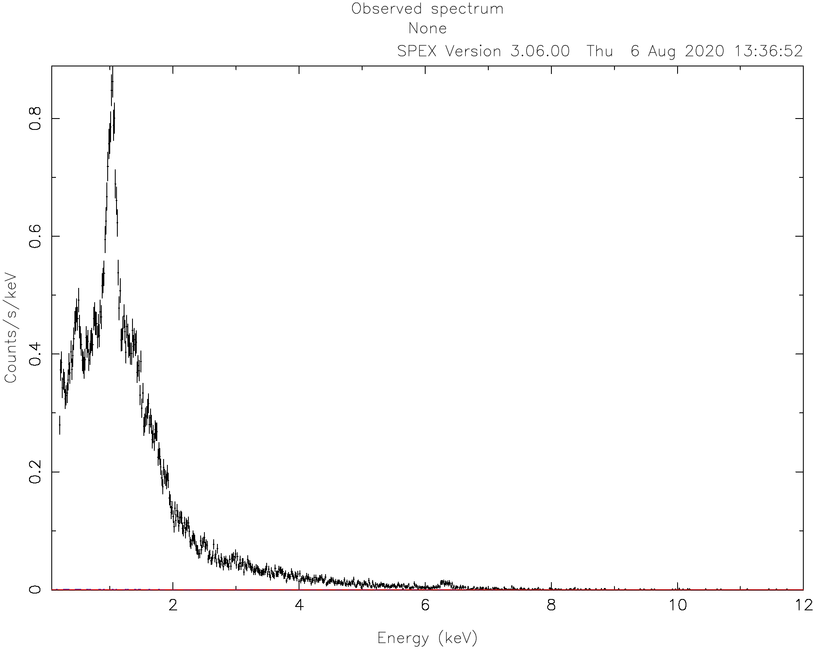
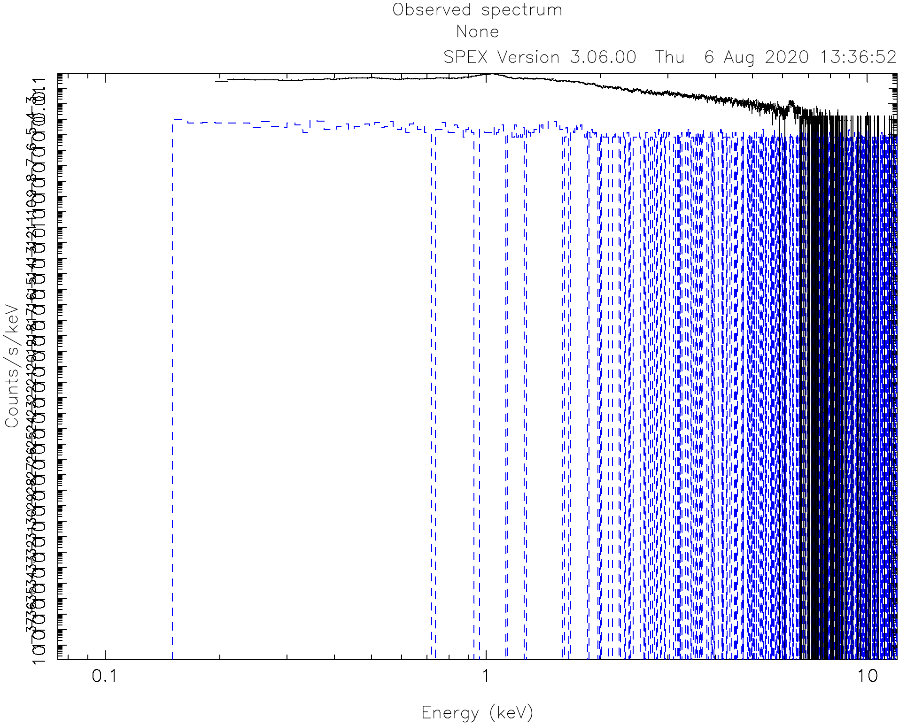
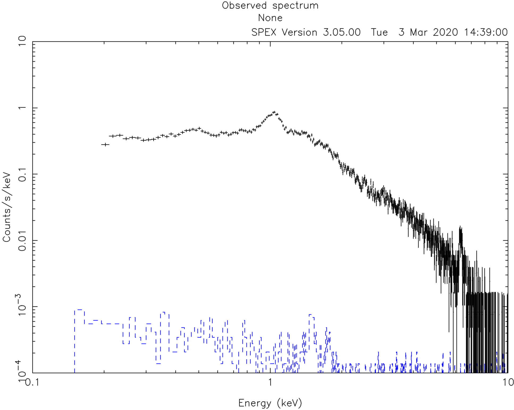
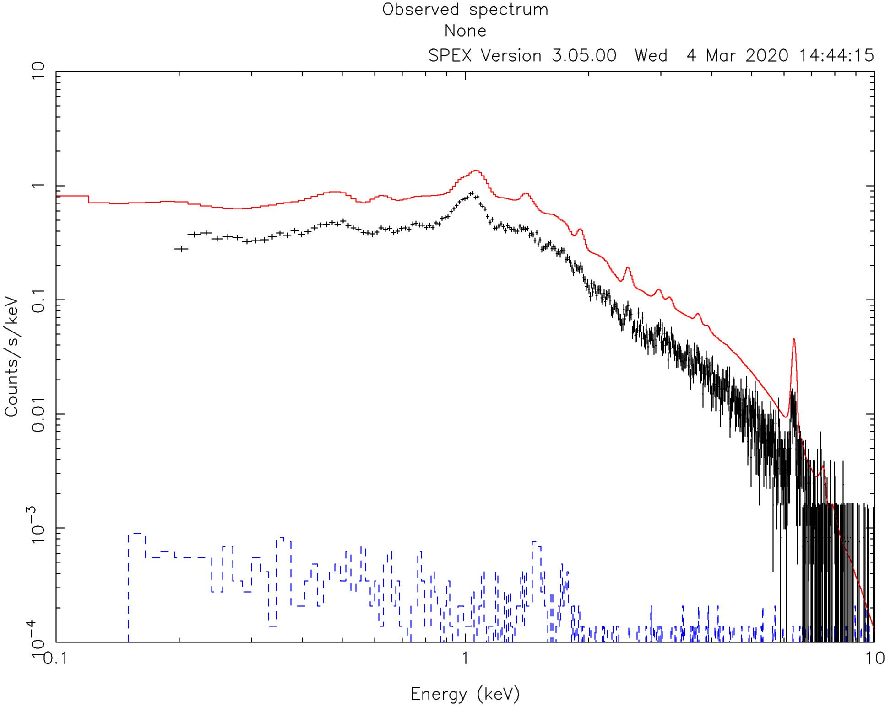
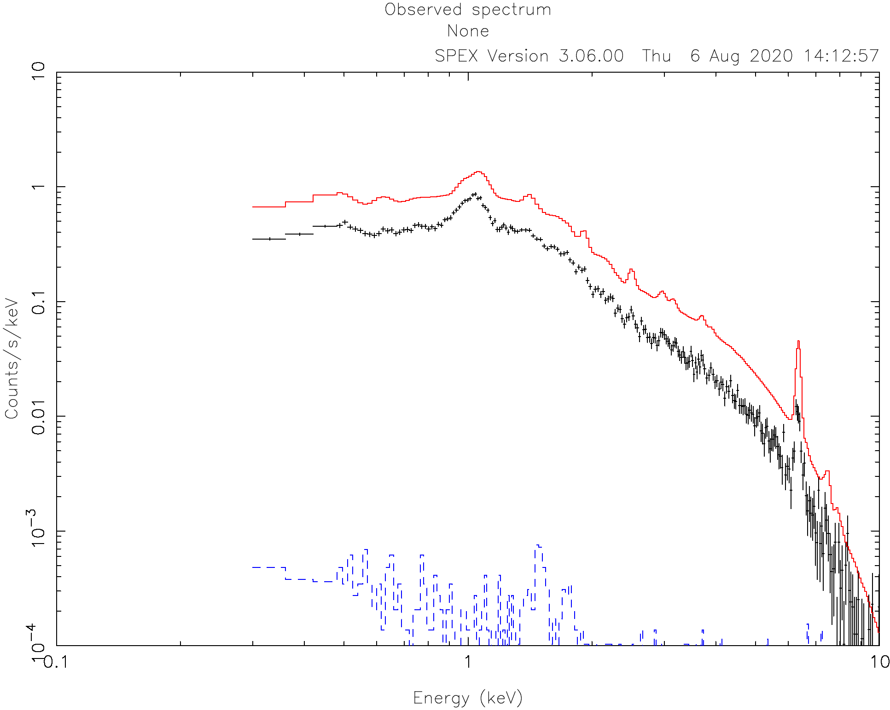
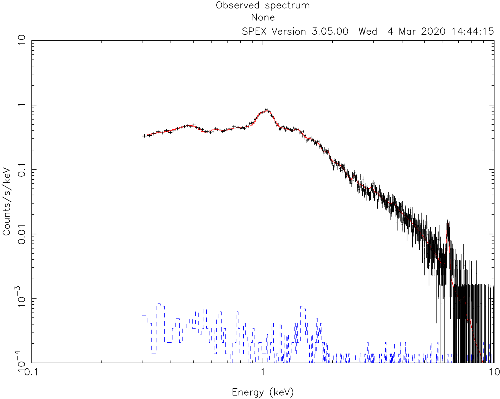

.. _sec:ccdspectrum:

Fitting a CCD spectrum
======================

.. highlight :: none

Goal
----

To load and fit a CCD spectrum (e.g. MOS1 aboard XMM-Newton) into SPEX.

Preparation
-----------

To be able to fit a spectrum, you need a spectrum and response file in SPEX format. To convert spectra from OGIP
format (e.g. pha, arf, rmf) to SPEX format, please use the ``trafo`` program like described in :ref:`sect:runtrafo`.
If you have the `Pyspextools package <https://github.com/spex-xray/pyspextools>`_ installed, then you can use
`ogip2spex <https://spex-xray.github.io/pyspextools/tutorials/ogip2spex.html>`_ as an alternative to ``trafo``.

Using the commands above, you can obtain a .spo and .res file containing your spectrum. To follow this thread, you
can also download example files here: :download:`mos.spo <mos.spo>` and :download:`mos.res <mos.res>`.

Starting SPEX
-------------

The SPEX program is started by entering ``spex`` in a linux terminal window. In the following sections we describe
one run of the program. To start SPEX do this:

::

   user@linux:~> spex
    Welcome user to SPEX version 3.05.00

   SPEX>

If SPEX does not run, please check if you set the ``SPEX90`` variable right and sourced ``spexdist.(c)sh``
as explained in :ref:`sec:install`.

Loading data
------------

Then, we have to load the data files. This is done using the ``data`` command (:ref:`sec:data`). It is a general thing
in SPEX that filename extensions are not typed explicitly when issuing a command. If you have a file called
``mos.spo`` and ``mos.res`` then you type:

::

   SPEX> data mos mos

The response file (``mos.res``) is entered first and then the file containing the spectrum (``mos.spo``). You can avoid
confusion by giving the same filename to both .res and .spo files. Remember that the order of the words in the commands
is very important!

Plot the data
-------------

It really helps to see the spectrum while we are working on it, so we need a plot window and tell spex that we want
to see a plot of the data. (Note that the text after the # is a comment and should not be copied on the command line).

::

   SPEX> plot dev xs             # Open plot device `X server`
   SPEX> plot type data          # Choose the plot type `data`
   SPEX> plot

The commands above open a PGPLOT window and set the plot type to ``data``, which means that the observed spectrum
and the model (folded through the response matrix) will be shown. The last ``plot`` command tells SPEX to
refresh the plot.

Usually CCD spectra benefit from a logarithmic scale on both the X and Y axes:

::

   SPEX> plot x log
   SPEX> plot y log

By default, the ranges of the axes are usually too broad. For this spectrum, the X axis range is good between 0.1 and
10 keV and the Y axis range between 1E-4 and 10.

::

   SPEX> plot rx 0.1:10.
   SPEX> plot ry 1E-4:10.

Define the model
----------------

Next we can define the model that we want to fit. In this case, we are looking at a MOS spectrum of a
galaxy cluster. The simplest model that we can try is a single temperature spectrum absorbed by gas in
the ISM. We also add a redshift component ``reds`` to shift the energy of the model spectrum with the
right amount:

::

    SPEX> com reds
    You have defined    1 component.
    SPEX> com hot
    You have defined    2 components.
    SPEX> com cie
    You have defined    3 components.

The ``hot`` model is actually a gas in equilibrium in absorption, which is a fair representation of the
neutral gas phase of the ISM. Later we will put the temperature of this component to :math:`5 \times 10^{-4}` keV
to emulate a neutral plasma.

The ``cie`` model represents a single temperature plasma in collisional ionisation equilibrium, which is commonly used
for clusters.

Then the components need to be related to each other, which means you need to specify how the multiplicative models
should be applied to the additive models. The multiplicative components should be listed in order from the source to
the observer:

::

    SPEX> com rel 3 1,2

This means that the emitted CIE component (#3) will be first redshifted by component #1 and then absorbed by component
#2. If you have multiple additive components, this should be done for each one. It is possible to supply a range of
components.

::

    SPEX> calc
    SPEX> plot

Calculating and plotting the model unsurprisingly results in a curve that is not near to the data.

.. figure:: ccd4.png
   :width: 600

Initial guess of parameters
---------------------------

To help the spectral fitting process, it is good to provide initial guesses for the model parameters. This way, the
spectral fit starts already with a model that is in the right direction. As a more experienced user, you usually have
a rough idea what the parameters should be by looking at the raw spectrum. For this cluster, for example, the
redshift is around 0.05, the absorption column is small, and the temperature of the cluster is around 3 keV.
We can set the guess parameters as follows:

::

    SPEX> par 1 1 z v 0.05
    SPEX> par 1 1 z s t
    SPEX> par 1 2 t v 5E-4
    SPEX> par 1 2 t s f
    SPEX> par 1 2 nh v 1E-4
    SPEX> par 1 3 norm v 1000.
    SPEX> par 1 3 t v 3.0
    SPEX> ca
    SPEX> pl

As we can see from the image, the first guess of the model is already in the right direction.

In this example, we assume that the exact redshift is unknown. However, if you do have an accurate measurement of
the distance, it is wise to set that distance in SPEX:

::

    SPEX> dist 0.05 z

The command above sets the distance to 0.05 z and makes sure that the luminosities are correctly calculated.
Note that this distance change also affects the values of the normalisation of the models!

Fit the model
-------------

We are now ready to fit the spectrum. To see the fitting steps, we can give the command ``fit print 1``. This needs
to be set only once per session. A subsequent ``fit`` command starts to optimize the parameters:

::

    SPEX> fit print 1
    SPEX> fit
       50865.8      5.000E-02  1.000E-04  1.000E+03   3.00
       6159.59      5.225E-02  3.728E-04   485.       2.21
       5298.40      5.318E-02  3.756E-04   543.       2.30
       5280.39      5.503E-02  3.791E-04   545.       2.29
       5273.64      5.579E-02  3.774E-04   545.       2.30
       5271.29      5.634E-02  3.784E-04   545.       2.30
       5269.85      5.656E-02  3.784E-04   545.       2.30
       5269.84      5.651E-02  3.784E-04   545.       2.30
       5269.81      5.652E-02  3.783E-04   545.       2.30
       5269.81      5.652E-02  3.783E-04   545.       2.30
    --------------------------------------------------------------------------------------------------
    sect comp mod  acro parameter with unit     value      status    minimum   maximum lsec lcom lpar

       1    1 reds z    Redshift             5.6520663E-02 thawn    -1.0      1.00E+10
       1    1 reds flag Flag: cosmo=0, vel=1  0.000000     frozen    0.0       1.0

       1    2 hot  nh   X-Column (1E28/m**2) 3.7826155E-04 thawn     0.0      1.00E+20
       1    2 hot  t    Temperature (keV)    5.0000002E-04 frozen   5.00E-04  1.00E+03
       1    2 hot  rt   T(balance) / T(spec)  1.000000     frozen   1.00E-04  1.00E+04
       1    2 hot  fcov Covering fraction     1.000000     frozen    0.0       1.0
       1    2 hot  v    RMS Velocity (km/s)   100.0000     frozen    0.0      3.00E+05
       1    2 hot  rms  RMS blend    (km/s)   0.000000     frozen    0.0      1.00E+05
       1    2 hot  dv   Vel. separ. (km/s)    100.0000     frozen    0.0      1.00E+05
       1    2 hot  zv   Average vel. (km/s)   0.000000     frozen  -1.00E+05  1.00E+05
       1    2 hot  ref  Reference atom        1.000000     frozen    1.0       30.
       1    2 hot  01   Abundance H           1.000000     frozen    0.0      1.00E+10
       1    2 hot  02   Abundance He          1.000000     frozen    0.0      1.00E+10
       1    2 hot  03   Abundance Li          1.000000     frozen    0.0      1.00E+10
       1    2 hot  04   Abundance Be          1.000000     frozen    0.0      1.00E+10
       1    2 hot  05   Abundance B           1.000000     frozen    0.0      1.00E+10
       1    2 hot  06   Abundance C           1.000000     frozen    0.0      1.00E+10
       1    2 hot  07   Abundance N           1.000000     frozen    0.0      1.00E+10
       1    2 hot  08   Abundance O           1.000000     frozen    0.0      1.00E+10
       1    2 hot  09   Abundance F           1.000000     frozen    0.0      1.00E+10
       1    2 hot  10   Abundance Ne          1.000000     frozen    0.0      1.00E+10
       1    2 hot  11   Abundance Na          1.000000     frozen    0.0      1.00E+10
       1    2 hot  12   Abundance Mg          1.000000     frozen    0.0      1.00E+10
       1    2 hot  13   Abundance Al          1.000000     frozen    0.0      1.00E+10
       1    2 hot  14   Abundance Si          1.000000     frozen    0.0      1.00E+10
       1    2 hot  15   Abundance P           1.000000     frozen    0.0      1.00E+10
       1    2 hot  16   Abundance S           1.000000     frozen    0.0      1.00E+10
       1    2 hot  17   Abundance Cl          1.000000     frozen    0.0      1.00E+10
       1    2 hot  18   Abundance Ar          1.000000     frozen    0.0      1.00E+10
       1    2 hot  19   Abundance K           1.000000     frozen    0.0      1.00E+10
       1    2 hot  20   Abundance Ca          1.000000     frozen    0.0      1.00E+10
       1    2 hot  21   Abundance Sc          1.000000     frozen    0.0      1.00E+10
       1    2 hot  22   Abundance Ti          1.000000     frozen    0.0      1.00E+10
       1    2 hot  23   Abundance V           1.000000     frozen    0.0      1.00E+10
       1    2 hot  24   Abundance Cr          1.000000     frozen    0.0      1.00E+10
       1    2 hot  25   Abundance Mn          1.000000     frozen    0.0      1.00E+10
       1    2 hot  26   Abundance Fe          1.000000     frozen    0.0      1.00E+10
       1    2 hot  27   Abundance Co          1.000000     frozen    0.0      1.00E+10
       1    2 hot  28   Abundance Ni          1.000000     frozen    0.0      1.00E+10
       1    2 hot  29   Abundance Cu          1.000000     frozen    0.0      1.00E+10
       1    2 hot  30   Abundance Zn          1.000000     frozen    0.0      1.00E+10
       1    2 hot  file File electr.distrib.

       1    3 cie  norm ne nX V (1E64/m**3)   545.4489     thawn     0.0      1.00E+20
       1    3 cie  t    Temperature (keV)     2.300449     thawn    5.00E-04  1.00E+03
       1    3 cie  sig  Sigma                 0.000000     frozen    0.0      1.00E+04
       1    3 cie  sup  Sigma up              0.000000     frozen    0.0      1.00E+04
       1    3 cie  logt T grid (lin/log)      1.000000     frozen    0.0       1.0
       1    3 cie  ed   El  dens (1E20/m**3) 9.9999998E-15 frozen   1.00E-22  1.00E+10
       1    3 cie  it   Ion temp  (keV)       1.000000     frozen   1.00E-04  1.00E+07
       1    3 cie  rt   T(balance) / T(spec)  1.000000     frozen   1.00E-04  1.00E+04
       1    3 cie  vmic Microturb vel (km/s)  0.000000     frozen    0.0      3.00E+05
       1    3 cie  ref  Reference atom        1.000000     frozen    1.0       30.
       1    3 cie  01   Abundance H           1.000000     frozen    0.0      1.00E+10
       1    3 cie  02   Abundance He          1.000000     frozen    0.0      1.00E+10
       1    3 cie  03   Abundance Li          1.000000     frozen    0.0      1.00E+10
       1    3 cie  04   Abundance Be          1.000000     frozen    0.0      1.00E+10
       1    3 cie  05   Abundance B           1.000000     frozen    0.0      1.00E+10
       1    3 cie  06   Abundance C           1.000000     frozen    0.0      1.00E+10
       1    3 cie  07   Abundance N           1.000000     frozen    0.0      1.00E+10
       1    3 cie  08   Abundance O           1.000000     frozen    0.0      1.00E+10
       1    3 cie  09   Abundance F           1.000000     frozen    0.0      1.00E+10
       1    3 cie  10   Abundance Ne          1.000000     frozen    0.0      1.00E+10
       1    3 cie  11   Abundance Na          1.000000     frozen    0.0      1.00E+10
       1    3 cie  12   Abundance Mg          1.000000     frozen    0.0      1.00E+10
       1    3 cie  13   Abundance Al          1.000000     frozen    0.0      1.00E+10
       1    3 cie  14   Abundance Si          1.000000     frozen    0.0      1.00E+10
       1    3 cie  15   Abundance P           1.000000     frozen    0.0      1.00E+10
       1    3 cie  16   Abundance S           1.000000     frozen    0.0      1.00E+10
       1    3 cie  17   Abundance Cl          1.000000     frozen    0.0      1.00E+10
       1    3 cie  18   Abundance Ar          1.000000     frozen    0.0      1.00E+10
       1    3 cie  19   Abundance K           1.000000     frozen    0.0      1.00E+10
       1    3 cie  20   Abundance Ca          1.000000     frozen    0.0      1.00E+10
       1    3 cie  21   Abundance Sc          1.000000     frozen    0.0      1.00E+10
       1    3 cie  22   Abundance Ti          1.000000     frozen    0.0      1.00E+10
       1    3 cie  23   Abundance V           1.000000     frozen    0.0      1.00E+10
       1    3 cie  24   Abundance Cr          1.000000     frozen    0.0      1.00E+10
       1    3 cie  25   Abundance Mn          1.000000     frozen    0.0      1.00E+10
       1    3 cie  26   Abundance Fe          1.000000     frozen    0.0      1.00E+10
       1    3 cie  27   Abundance Co          1.000000     frozen    0.0      1.00E+10
       1    3 cie  28   Abundance Ni          1.000000     frozen    0.0      1.00E+10
       1    3 cie  29   Abundance Cu          1.000000     frozen    0.0      1.00E+10
       1    3 cie  30   Abundance Zn          1.000000     frozen    0.0      1.00E+10
       1    3 cie  file File electr.distrib.
       1    3 cie  x1   T1/T0                 1.000000     frozen    1.0      1.00E+10
       1    3 cie  y1   N1/N0                 0.000000     frozen    0.0      1.00E+10

    Instrument     1 region    1 has norm    1.00000E+00 and is frozen
    ---------------------------------------------------------------------------------------------
    sect comp mod  acro parameter with unit      sect comp mod  acro parameter with unit  correl.

       1    1 reds z    Redshift             <->    1    2 hot  nh   X-Column (1E28/m**2)   0.006
       1    1 reds z    Redshift             <->    1    3 cie  norm ne nX V (1E64/m**3)    0.035
       1    1 reds z    Redshift             <->    1    3 cie  t    Temperature (keV)      0.200
       1    2 hot  nh   X-Column (1E28/m**2) <->    1    3 cie  norm ne nX V (1E64/m**3)    0.582
       1    2 hot  nh   X-Column (1E28/m**2) <->    1    3 cie  t    Temperature (keV)     -0.173
       1    3 cie  norm ne nX V (1E64/m**3)  <->    1    3 cie  t    Temperature (keV)      0.069

    --------------------------------------------------------------------------------
     Fluxes and restframe luminosities between   2.0000     and    10.000     keV

     sect comp mod   photon flux   energy flux nr of photons    luminosity
                  (phot/m**2/s)      (W/m**2)   (photons/s)           (W)
        1    3 cie    4.23975      2.265908E-15  5.845445E+45  3.101105E+30

     Fit method        : Classical Levenberg-Marquardt
     Fit statistic     : C-statistic
     C-statistic       :      5269.81
     Expected C-stat   :       660.01 +/-        34.94
     Chi-squared value :   2307566.25
     Degrees of freedom:       791
     W-statistic       :         0.00

At the end of the optimization step, SPEX prints out an overview of the fit parameters and the fit statistics. Here we
can see that the fit improved, but there is still a lot of room for improvement.

Do additional selections on the data
------------------------------------

In the beginning, we did not ignore possible bad energy intervals in the spectrum. For MOS1, for example, we know that
the calibration is valid for the energy range between roughly 0.3 keV and 10 keV. To fit only the good spectral
interval, we need to ignore the parts at low and high energies.

::

    SPEX> ignore 0:0.3 unit kev
    SPEX> ignore 10:100 unit kev
    SPEX> plot

The plot shows that the data points below 0.3 keV have disappeared. When we fit again, the C-statistics value improves
a lot:

::

    SPEX> fit
     ...
     Fit method        : Classical Levenberg-Marquardt
     Fit statistic     : C-statistic
     C-statistic       :       798.47
     Expected C-stat   :       615.03 +/-        33.31
     Chi-squared value :      3421.64
     Degrees of freedom:       643
     W-statistic       :         0.00

Fitting abundances
------------------

Although the C-statistics improved, there are still residuals in the spectrum, especially around the strongest spectral
lines. This is because the metal abundances in the gas are still fixed to 1.0. We can let the abundances vary in the
optimization by setting them to thawn:

::

    SPEX> par 1 3 08 s t
    SPEX> par 1 3 12 s t
    SPEX> par 1 3 14 s t
    SPEX> par 1 3 16 s t
    SPEX> par 1 3 18 s t
    SPEX> par 1 3 20 s t
    SPEX> par 1 3 26 s t
    SPEX> par 1 3 28 s t
    SPEX> fit

The optimization leads to an even better fit:

::

     Fit method        : Classical Levenberg-Marquardt
     Fit statistic     : C-statistic
     C-statistic       :       654.72
     Expected C-stat   :       614.18 +/-        33.29
     Chi-squared value :      3157.79
     Degrees of freedom:       635
     W-statistic       :         0.00

Calculating errors
------------------

When we have the best fit, we can calculate the errors. This has to be done per parameter. Below we calculate,
for example, the error on the best fit temperature:

::

    SPEX> error 1 3 t
     parameter          C-stat      Delta          Delta
       value            value       parameter     C-stat
    ----------------------------------------------------
       2.34612          655.90     -2.367735E-02    1.18
       2.34973          655.56     -2.005935E-02    0.84
       2.34806          655.60     -2.173662E-02    0.89
       2.34709          655.83     -2.270699E-02    1.12
       2.34757          655.78     -2.222180E-02    1.06
       2.34781          655.72     -2.197933E-02    1.01
       2.34793          655.68     -2.186084E-02    0.96
       2.39347          655.50      2.367735E-02    0.79
       2.41715          658.33      4.735494E-02    3.62
       2.39347          655.50      2.367735E-02    0.79
       2.39526          655.67      2.547121E-02    0.95
       2.39577          655.74      2.597785E-02    1.03
       2.39553          655.69      2.574086E-02    0.97
     Parameter   1    3 t   :    2.3698     Errors:  -2.18608E-02 ,   2.57409E-02

The error command reports the best fit value for the temperature and the lower and upper 1 sigma (68%) confidence
level.

Usually, the error calculation stage is the end point of a spectral analysis. In this example,
we can quit SPEX now:

::

    SPEX> quit
    Thank you for using SPEX!
