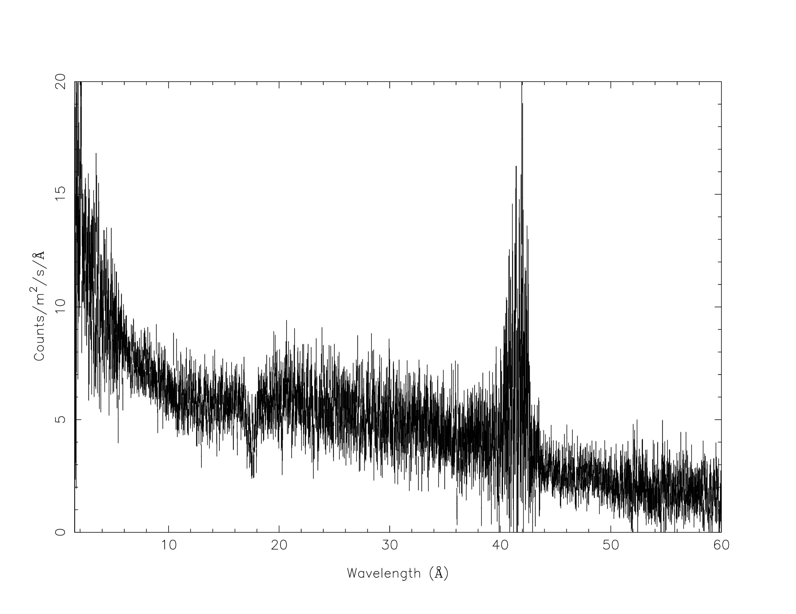
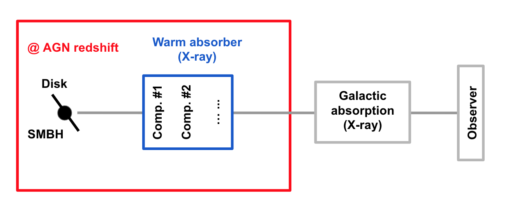
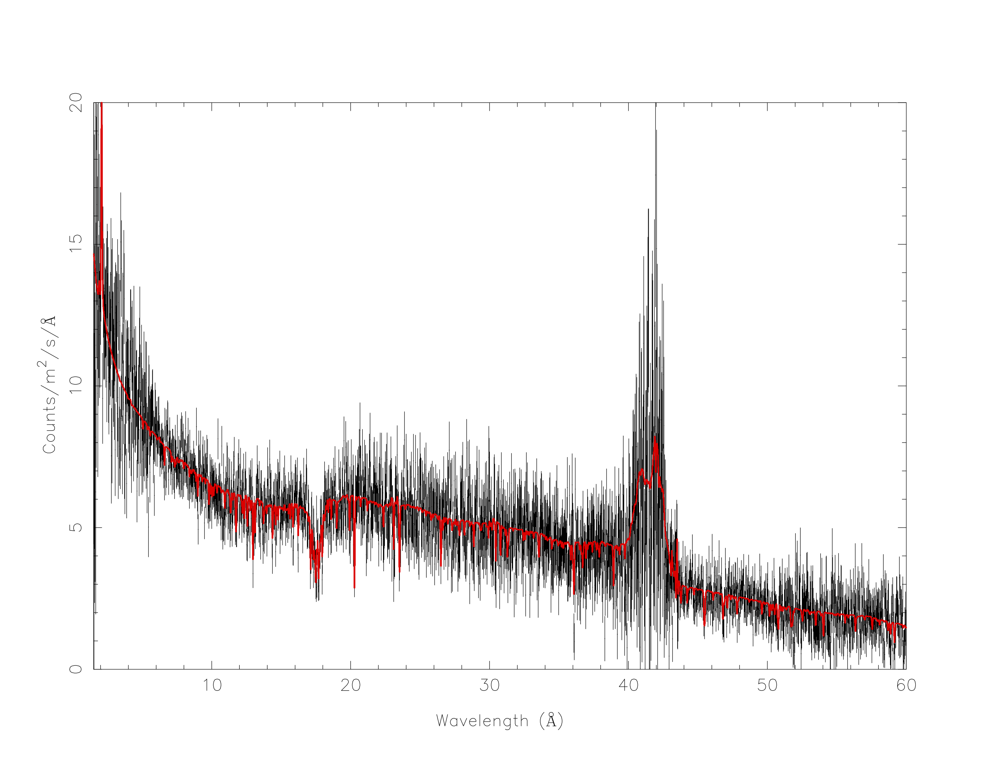

.. _sec:pionabs:

PION setup for AGN warm absorber
================================

.. highlight :: none

Goal
----

Setup the PION model for the warm absorber in a nearby Seyfert 1 galaxy observed with Chandra HRC/LETGS.

.. note:: A simulated spectrum was used because this thread merely intends to show the setup of the PION model.

Preparation
-----------

To follow this thread, you need to download the example files here: :download:`chl.spo <chl.spo>` and :download:`chl.res <chl.res>`.

Start SPEX
-------------

Start SPEX in a linux terminal window:

::

   user@linux:~> spex
    Welcome user to SPEX version 3.05.00

   SPEX>

Load data
------------
A command file tailored for this thread to load data is available here :download:`data.com <data.com>`
::

   user@linux:~> cat data.com
   # Simulated data
   #---------------
   # HRC/LETGS DATA
   data chl chl
   bin inst 1 reg 1 0:10000 2 unit ang
   ignore inst 1 reg 1 0:1.5 unit ang
   ignore inst 1 reg 1 60:1000 unit ang

Load the above command file into SPEX:

::

   SPEX> log exe data

Plot data
-------------
A command file tailored for this thread to plot the data is available here :download:`plot.com <plot.com>`

::

   user@linux:~> cat plot.com
   # plot setting
   plot dev xw
   plot type data
   plot x lin
   plot ux a
   plot rx 1.5:60
   plot y lin
   plot uy fa
   plot ry 0:20
   plot set 1
   plot back disp f
   plot fill disp f
   plot cap id disp f
   plot cap ut disp f
   plot cap lt disp f
   plot

Load the above command file into SPEX:
::
   SPEX> log exe plot

Define model components and component relations (step-by-step)
------------------------------------------------------------------

Here we are looking at the warm absorber in a nearby (z = 0.07) Seyfert 1 galaxy.

Step 1: Set the distance of the source.

::

    SPEX> dist 0.07 z
    Distances assuming H0 =  70.0 km/s/Mpc, Omega_m = 0.300 Omega_Lambda = 0.700 Omega_r = 0.000
    Sector       m      A.U.        ly        pc       kpc       Mpc  redshift        cz   age(yr)
    ----------------------------------------------------------------------------------------------
    1 9.740E+24 6.511E+13 1.030E+09 3.157E+08 3.157E+05  315.6554    0.0700   20985.5 9.302E+08
    ----------------------------------------------------------------------------------------------
    SPEX> com reds
    You have defined    1 component.
    SPEX> par 1 1 z val 0.07

Step 2: Set the redshift component.
::

    SPEX> com reds
    You have defined    1 component.
    SPEX> par 1 1 z val 0.07

Step 3: Set the galactic absorption.
::

    SPEX> com hot
    You have defined    2 components.
    SPEX> par 1 2 nh val 2.0e-4
    SPEX> par 1 2 t val 5E-4
    SPEX> par 1 2 t s f
    SPEX> par 1 2 nh s f

Step 4: Set the intrinsic spectral-energy-distribution (SED) of the AGN above the Lyman limit along our line-of-sight.

For a typical Seyfert 1 galaxy, the SED has three components `(Mehdipour et al. 2015) <https://ui.adsabs.harvard.edu/abs/2015A%26A...575A..22M/abstract>`_:
  - A Comptonized disk component (``comt``) for optical to soft X-rays data
  - A power-law component (``pow``) for X-ray data
  - A neutral reflection component (``refl``) for hard X-rays data. Usually, the reflection component has an exponential cut-off energy (300 keV here).
::

    SPEX> com comt
    You have defined    3 components.
    SPEX> par 1 3 norm val 0.
    SPEX> par 1 3 norm s f
    SPEX> par 1 3 t0 val 5e-4
    SPEX> par 1 3 t0 s f
    SPEX> par 1 3 t1 val 0.15
    SPEX> par 1 3 t1 s f
    SPEX> par 1 3 tau val 20
    SPEX> par 1 3 tau s f
    SPEX> com pow
    You have defined    4 components.
    SPEX> par 1 4 norm val 1.E+09
    SPEX> par 1 4 norm s t
    SPEX> par 1 4 gamm val 1.7
    SPEX> par 1 4 gamm s t
    SPEX> com refl
    You have defined    5 components.
    SPEX> par 1 5 norm couple 1 4 norm
    SPEX> par 1 5 gamm couple 1 4 gamm
    SPEX> par 1 5 ecut val 300
    SPEX> par 1 5 ecut s f
    SPEX> par 1 5 pow:fgr v 0
    SPEX> par 1 5 scal val 1.
    SPEX> par 1 5 scal s f

Step 5: Apply exponential cut-off to the power-law component of the SED both below the Lyman limit and above the high-energy cut-off.
.. note:: The ``ecut`` parameter in the ``refl`` component applies to itself only.

::

    SPEX> com etau
    You have defined    6 components.
    SPEX> par 1 6 a val -1
    SPEX> par 1 6 a s f
    SPEX> par 1 6 tau val 1.3605E-2
    SPEX> par 1 6 tau s f
    SPEX> com etau
    You have defined    7 components.
    SPEX> par 1 7 a val 1
    SPEX> par 1 7 a s f
    SPEX> par 1 7 tau val 3.3333E-3
    SPEX> par 1 7 tau s f

Step 6: Set the PION (absorption) components.

Here we introduce three PION components. The parameters of the PION components are restricted to improve the efficiency of a realistic fitting process. ``fcov=1`` refers to the PION component fully covers the line-of-sight. ``omeg=1.E-7`` refers to a negligible solid angle (:math:`\Omega`) subtended by the PION component with respect to the nucleus (omeg = :math:`\Omega / 4 \pi`).

.. note:: The third ``pion`` component is a spare one with ``fcov=0`` and ``omeg=0``. This is practical when analyzing real data without any prior knowledge of the number of PION components required.

.. note:: To see the density effect of the absorption features, it is necessary to set a non-zero ``omeg`` value.
::

    SPEX> com pion
    You have defined    8 components.
    ** Pion model: take care about proper COM REL use: check manual!
    SPEX> com pion
    You have defined    9 components.
    ** Pion model: take care about proper COM REL use: check manual!
    SPEX> com pion
    You have defined    10 components.
    ** Pion model: take care about proper COM REL use: check manual!
    SPEX> par 1 8:10 nh range 1.E-7:1.E1
    SPEX> par 1 8:10 xil range -5:5
    SPEX> par 1 8:10 omeg range 0:1
    SPEX> par 1 8 nh val 5.E-03
    SPEX> par 1 8 xil val 2.7
    SPEX> par 1 8 zv val -500
    SPEX> par 1 8 zv s t
    SPEX> par 1 8 v val 100
    SPEX> par 1 8 v s t
    SPEX> par 1 8 omeg val 1.E-7
    SPEX> par 1 9 nh val 2.E-03
    SPEX> par 1 9 xil val 1.6
    SPEX> par 1 9 zv val -100
    SPEX> par 1 9 zv s t
    SPEX> par 1 9 v val 50
    SPEX> par 1 9 v s t
    SPEX> par 1 9 omeg val 1.E-7
    SPEX> par 1 10 nh val 1.E-7
    SPEX> par 1 10 xil val 0
    SPEX> par 1 10 fcov val 0
    SPEX> par 1 10 omega val 0

Step 7: Set the component relation for the intrinsic AGN SED above the Lyman limit along our line-of-sight.

.. note:: Photons from both the Comptonized disk and power-law components are screened by the warm absorber components at the redshift of the target, as well as the galactic absorption before reaching the detector. Photons from the neutral reflection component is assumed not to be screened by the warm absorber for simplicity. It is still redshifted and requires the galactic absorption.

::

    SPEX> com rel 3 8,9,10,1,2
    SPEX> com rel 4 6,7,8,9,10,1,2
    SPEX> com rel 5 1,2

Step 8: Set the component relation for the PION components. Assuming that the warm absorber components closer to the central engine are defined first (with a smaller component index), photons transmitted from the inner PION components (with a nonzero ``omeg`` value) are screened by all the outer PION components at the redshift of the target, as well as the galactic absorption before reaching the detector.

::

    SPEX> com rel 8 9,10,1,2
    SPEX> com rel 9 10,1,2
    SPEX> com rel 10 1,2

Next, we check the setting of the component relation
::

    SPEX> model show
    --------------------------------------------------------------------------------
    Number of sectors         :     1
    Sector:    1 Number of model components:    10
    Nr.    1: reds
    Nr.    2: hot
    Nr.    3: comt[8,9,10,1,2 ]
    Nr.    4: pow [6,7,8,9,10,1,2 ]
    Nr.    5: refl[1,2 ]
    Nr.    6: etau
    Nr.    7: etau
    Nr.    8: pion[9,10,1,2 ]
    Nr.    9: pion[10,1,2 ]
    Nr.   10: pion[1,2 ]

Next, we check the setting of the free parameters and calculate the 1--1000 Ryd ionizing luminosity
::

    SPEX> elim 1.E0:1.E3 ryd
    SPEX> calc
    SPEX> plot
    SPEX> par show free
    --------------------------------------------------------------------------------------------------
    sect comp mod  acro parameter with unit     value      status    minimum   maximum lsec lcom lpar

       1    3 comt norm Norm (1E44 ph/s/keV) 3.0000001E+12 thawn     0.0      1.00E+20
       1    3 comt t0   Wien temp (keV)      5.0000002E-04 thawn    1.00E-05  1.00E+10
       1    3 comt t1   Plasma temp (keV)    0.1500000     thawn    1.00E-05  1.00E+10
       1    3 comt tau  Optical depth         20.00000     thawn    1.00E-03  1.00E+03

       1    4 pow  norm Norm (1E44 ph/s/keV) 1.0000000E+09 thawn     0.0      1.00E+20
       1    4 pow  gamm Photon index          1.700000     thawn    -10.       10.

       1    8 pion nh   X-Column (1E28/m**2) 4.9999999E-03 thawn    1.00E-07   10.
       1    8 pion xil  Log xi (1E-9 Wm)      2.700000     thawn    -5.0       5.0
       1    8 pion v    RMS Velocity (km/s)   100.0000     thawn     0.0      3.00E+05
       1    8 pion zv   Average vel. (km/s)  -500.0000     thawn   -1.00E+05  1.00E+05

       1    9 pion nh   X-Column (1E28/m**2) 2.0000001E-03 thawn    1.00E-07   10.
       1    9 pion xil  Log xi (1E-9 Wm)      1.600000     thawn    -5.0       5.0
       1    9 pion v    RMS Velocity (km/s)   50.00000     thawn     0.0      3.00E+05
       1    9 pion zv   Average vel. (km/s)  -100.0000     thawn   -1.00E+05  1.00E+05

    Instrument     1 region    1 has norm    1.00000E+00 and is frozen

    --------------------------------------------------------------------------------
     Fluxes and restframe luminosities between  1.36057E-02 and    13.606     keV

     sect comp mod   photon flux   energy flux nr of photons    luminosity
                  (phot/m**2/s)      (W/m**2)   (photons/s)           (W)
        1    3 comt   9.90871      4.310500E-16  1.447224E+54  7.988849E+36
        1    4 pow    243.883      6.246949E-14  2.869709E+54  1.021577E+38
        1    5 refl   5.98565      7.190691E-15  6.284842E+51  7.467485E+36
        1    8 pion  1.711172E-07  3.011339E-23  3.540241E+45  8.248552E+28
        1    9 pion  1.753678E-06  1.559744E-22  1.947966E+47  1.168208E+30
        1   10 pion   0.00000       0.00000       0.00000       0.00000

     Fit method        : Classical Levenberg-Marquardt
     Fit statistic     : C-statistic
     C-statistic       :      2424.54
     Expected C-stat   :      2348.67 +/-        68.66
     Chi-squared value :      2531.73
     Degrees of freedom:         0
     W-statistic       :      2353.74

This thread ends here.
::

    SPEX> quit
    Thank you for using SPEX!

Define model components and component relations (running scripts)
------------------------------------------------------------------
A command file tailored for this thread to setup the model components and parameters is available here :download:`mdl_pa.com <mdl_pa.com>`.

Load the above command file into SPEX:
::
   SPEX> log exe mdl_pa
