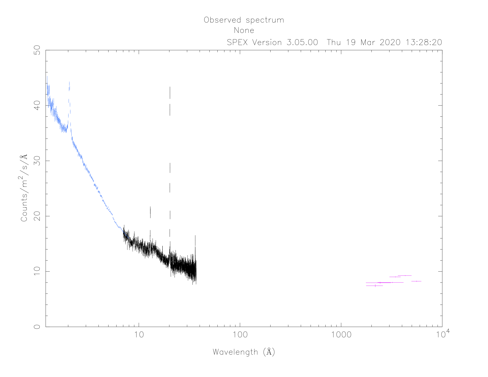
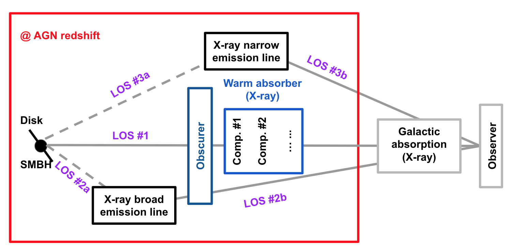
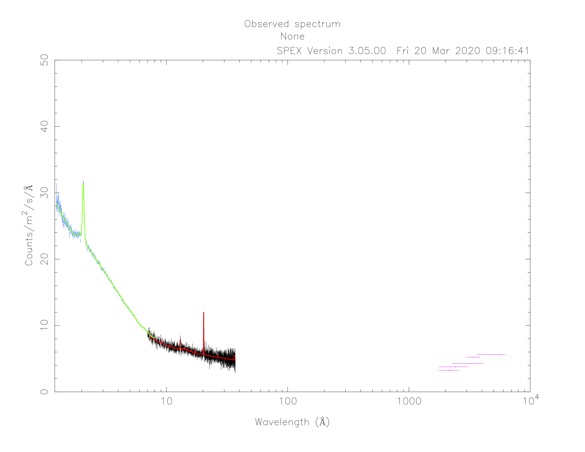
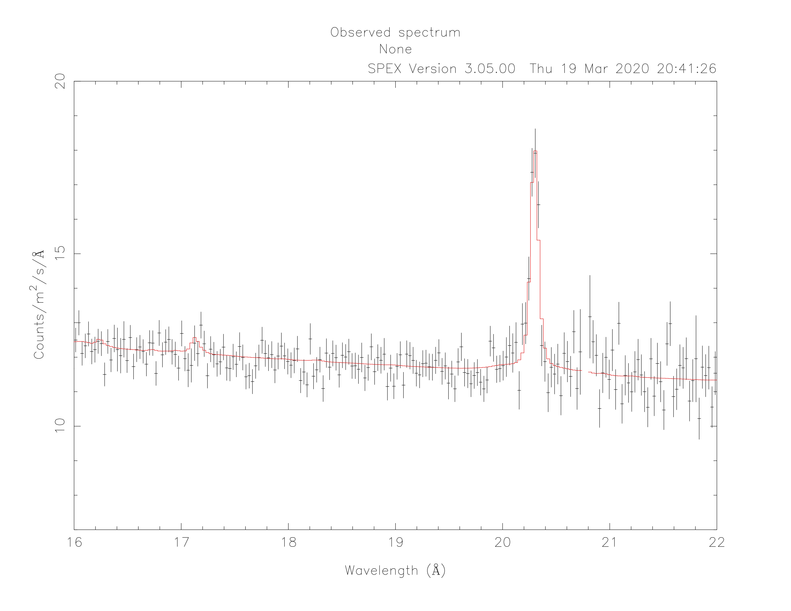

.. _sec:pionena:

PION setup for emission and absorption features in AGN
======================================================

.. highlight :: none

Goal
----

Setup the PION model for the emission and absorption features in a nearby Seyfert 1 galaxy observed with XMM-Newton (OM, RGS, and EPIC-pn).

.. note:: A simulated spectrum was used because this thread merely intends to show the setup of the PION model.

Preparation
-----------

To follow this thread, you need to download the example files here: :download:`pionena.tar.gz <pionena.tar.gz>`.
::

   user@linux:~> cd /path/to/your/folder/
   user@linux:~> mv ~/Downloads/pionena.tar.gz ./
   user@linux:~> tar -xvf pionena.tar.gz
   user@linux:~> cd pionena

Start SPEX
-------------

Start SPEX in a linux terminal window:

::

   user@linux:~> spex
    Welcome user to SPEX version 3.05.00

   SPEX>

Load data
------------
data.com is the command file tailored for this thread to load data.
::

   user@linux:~> cat data.com
   # RGS (inst 1)
   data rgs rgs
   # EPIC-pn (inst 2)
   data pn pn
   # OM (inst 3:8)
   data om_UVW2 om_UVW2
   data om_UVM2 om_UVM2
   data om_UVW1 om_UVW1
   data om_U om_U
   data om_B om_B
   data om_V om_V
   # ign/use, binning
   # RGS (inst 1)
   bin inst 1 reg 1 0:1000 2 unit ang
   ign inst 1 reg 1 0:7 unit ang
   ign inst 1 reg 1 37:1000 unit ang
   # EPIC-pn (inst 2)
   obin inst 2 reg 1 1:100000
   ign inst 2 reg 1 0:0.3 unit kev
   ign inst 2 reg 1 8:1000 unit ang
   ign inst 2 reg 1 10:1000 unit kev

Load the above command file into SPEX:

::

   SPEX> log exe data

Plot data
-------------
plot.com is the command file tailored for this thread to plot data.

::

   user@linux:~> cat plot.com
   # plotting
   plot dev xw
   plot type data
   plot ux a
   plot uy fa
   plot x log
   plot rx 1.2E0 1.E4
   plot y lin
   plot ry 0 50
   plot set 2
   plot da col 11
   plot mo col 3
   plot set 3:8
   plot da col 6
   plot set all
   plot back disp f
   plot

Load the above command file into SPEX:
::
   SPEX> log exe plot

Define model components and component relations (step-by-step)
------------------------------------------------------------------

Here we are receiving photons from three line-of-sights in a nearby (z = 0.07) Seyfert 1 galaxy.

Step 1: Set the distance of the source.

::

    SPEX> dist 0.07 z
    Distances assuming H0 =  70.0 km/s/Mpc, Omega_m = 0.300 Omega_Lambda = 0.700 Omega_r = 0.000
    Sector       m      A.U.        ly        pc       kpc       Mpc  redshift        cz   age(yr)
    ----------------------------------------------------------------------------------------------
    1 9.740E+24 6.511E+13 1.030E+09 3.157E+08 3.157E+05  315.6554    0.0700   20985.5 9.302E+08
    ----------------------------------------------------------------------------------------------

Step 2: Set the redshift component.
::

    SPEX> com reds
    You have defined    1 component.
    SPEX> par 1 1 z val 0.07

Step 3: Set the galactic absorption.
::

    SPEX> com hot
    You have defined    2 components.
    SPEX> par 1 2 nh val 2.0e-4
    SPEX> par 1 2 t val 5E-4
    SPEX> par 1 2 t s f
    SPEX> par 1 2 nh s f

Step 4: Set the components and component relations for line-of-sight #1.

Step 4a: Set the intrinsic spectral-energy-distribution (SED) of the AGN above the Lyman limit along line-of-sight #1.

For a typical Seyfert 1 galaxy, the SED has three components `(Mehdipour et al. 2015) <https://ui.adsabs.harvard.edu/abs/2015A%26A...575A..22M/abstract>`_:
  - A Comptonized disk component (``comt``) for optical to soft X-rays data
  - A power-law component (``pow``) for X-ray data
  - A neutral reflection component (``refl``) for hard X-rays data. Usually, the reflection component has an exponential cut-off energy (300 keV here).
::

    SPEX> com comt
    You have defined    3 components.
    SPEX> par 1 3 norm val 0.
    SPEX> par 1 3 norm s f
    SPEX> par 1 3 t0 val 5e-4
    SPEX> par 1 3 t0 s f
    SPEX> par 1 3 t1 val 0.15
    SPEX> par 1 3 t1 s f
    SPEX> par 1 3 tau val 20
    SPEX> par 1 3 tau s f
    SPEX> com pow
    You have defined    4 components.
    SPEX> par 1 4 norm val 1.E+09
    SPEX> par 1 4 norm s t
    SPEX> par 1 4 gamm val 1.7
    SPEX> par 1 4 gamm s t
    SPEX> com refl
    You have defined    5 components.
    SPEX> par 1 5 norm couple 1 4 norm
    SPEX> par 1 5 gamm couple 1 4 gamm
    SPEX> par 1 5 ecut val 300
    SPEX> par 1 5 ecut s f
    SPEX> par 1 5 pow:fgr v 0
    SPEX> par 1 5 scal val 1.
    SPEX> par 1 5 scal s f

Step 4b: Apply exponential cut-off to the power-law component of the SED both below the Lyman limit and above the high-energy cut-off.

.. note:: The ``ecut`` parameter in the ``refl`` component applies to itself only.

::

    SPEX> com etau
    You have defined    6 components.
    SPEX> par 1 6 a val -1
    SPEX> par 1 6 a s f
    SPEX> par 1 6 tau val 1.3605E-2
    SPEX> par 1 6 tau s f
    SPEX> com etau
    You have defined    7 components.
    SPEX> par 1 7 a val 1
    SPEX> par 1 7 a s f
    SPEX> par 1 7 tau val 3.3333E-3
    SPEX> par 1 7 tau s f

Step 4c: Set the PION (obscuring wind) components.

Here we introduce two PION components for the obscuring wind `(Kaastra et al. 2014) <https://ui.adsabs.harvard.edu/abs/2014Sci...345...64K/abstract>`_. The parameters of the PION components are restricted to improve the efficiency of a realistic fitting process.
.. note:: The second ``pion`` component is a spare one with ``fcov=0`` and ``omeg=0``. This is practical when analyzing real data without any prior knowledge of the number of PION components required.

::

    SPEX> com pion
    You have defined    8 components.
    ** Pion model: take care about proper COM REL use: check manual!
    SPEX> com pion
    You have defined    9 components.
    ** Pion model: take care about proper COM REL use: check manual!
    SPEX> par 1 8:9 nh range 1.E-7:1.E1
    SPEX> par 1 8:9 xil range -5:5
    SPEX> par 1 8 nh val 5.E-02
    SPEX> par 1 8 xil val 0.0
    SPEX> par 1 8 zv val -3000
    SPEX> par 1 8 zv s t
    SPEX> par 1 8 v val 1100
    SPEX> par 1 8 v s t
    SPEX> par 1 9 nh val 1.E-7
    SPEX> par 1 9 nh s f
    SPEX> par 1 9 xil val 0
    SPEX> par 1 9 xil s f
    SPEX> par 1 9 fcov val 0
    SPEX> par 1 9 omega val 0

Step 4d: Set the PION (warm absorber) components.

Here we introduce three PION components for the X-ray warm absorber. ``omeg=1.E-7`` refers to a negligible solid angle (:math:`\Omega`) subtended by the PION component with respect to the nucleus (omeg = :math:`\Omega / 4 \pi`).

.. note:: To see the density effect of the absorption features, it is necessary to set a non-zero ``omeg`` value.

::

    SPEX> com pion
    You have defined    10 components.
    ** Pion model: take care about proper COM REL use: check manual!
    SPEX> com pion
    You have defined    11 components.
    ** Pion model: take care about proper COM REL use: check manual!
    SPEX> com pion
    You have defined    12 components.
    ** Pion model: take care about proper COM REL use: check manual!
    SPEX> par 1 10:12 nh range 1.E-7:1.E1
    SPEX> par 1 10:12 xil range -5:5
    SPEX> par 1 10:12 omeg range 0:1
    SPEX> par 1 10 nh val 5.E-03
    SPEX> par 1 10 xil val 2.7
    SPEX> par 1 10 zv val -500
    SPEX> par 1 10 zv s t
    SPEX> par 1 10 v val 100
    SPEX> par 1 10 v s t
    SPEX> par 1 10 omeg val 1.E-7
    SPEX> par 1 11 nh val 2.E-03
    SPEX> par 1 11 xil val 1.6
    SPEX> par 1 11 zv val -100
    SPEX> par 1 11 zv s t
    SPEX> par 1 11 v val 50
    SPEX> par 1 11 v s t
    SPEX> par 1 11 omeg val 1.E-7
    SPEX> par 1 12 nh val 1.E-7
    SPEX> par 1 12 xil val 0
    SPEX> par 1 12 fcov val 0
    SPEX> par 1 12 omega val 0

Step 4f: Set the component relation for line-of-sight #1.

.. note:: Photons from both the Comptonized disk and power-law components are screened by the obscuring wind and warm absorber components at the redshift of the target, as well as the galactic absorption before reaching the detector. Photons from the neutral reflection component is assumed not to be screened by the obscuring wind and warm absorber for simplicity. It is still redshifted and requires the galactic absorption.

::

    SPEX> com rel 3 8,9,10,11,12,1,2
    SPEX> com rel 4 6,7,8,9,10,11,12,1,2
    SPEX> com rel 5 1,2

Step 4g: Set the component relation for the PION components. Assuming that the obscuring wind and warm absorber components closer to the central engine are defined first (with a smaller component index), photons transmitted from the inner PION components (with a nonzero ``omeg`` value) are screened by all the outer PION components at the redshift of the target, as well as the galactic absorption before reaching the detector.

::

    SPEX> com rel 8 9,10,11,12,1,2
    SPEX> com rel 9 10,11,12,1,2
    SPEX> com rel 10 11,12,1,2
    SPEX> com rel 11 12,1,2
    SPEX> com rel 12 1,2

Step 5: Set the components and component relations for line-of-sights #2 and #3.
Step 5a: Set the AGN SED above the Lyman limit along line-of-sights #2a and #3a.

::

    SPEX> com comt
    You have defined    13 components.
    SPEX> par 1 13 norm:type couple 1 3 norm:type
    SPEX> com pow
    You have defined    14 components.
    SPEX> par 1 14 norm:lum couple 1 4 norm:lum
    SPEX> com comt
    You have defined    15 components.
    SPEX> par 1 15 norm val 1.E12
    SPEX> par 1 15 norm s f
    SPEX> par 1 15 t0 val 3.E-4
    SPEX> par 1 15 t0 s f
    SPEX> par 1 15 t1 val 0.125
    SPEX> par 1 15 t1 s f
    SPEX> par 1 15 tau val 20
    SPEX> par 1 15 tau s f
    SPEX> com pow
    You have defined    16 components.
    SPEX> par 1 16 norm val 6.E9
    SPEX> par 1 16 norm s f
    SPEX> par 1 16 gamm val 1.6
    SPEX> par 1 16 gamm s f

Step 5b: Apply exponential cut-off to the above AGN SEDs at all energies because these photons do not reach us (dashed gray lines in Figure 1).

::

    SPEX> com etau
    You have defined    17 components.
    SPEX> par 1 17 tau val 1.E3
    SPEX> par 1 17 tau s f
    SPEX> par 1 17 a val 0
    SPEX> par 1 17 a s f

Step 5c: Set the PION (emission) components.

Here we introduce three PION components. The parameters of the PION components are restricted to improve the efficiency of a realistic fitting process. ``fcov=0`` for the emission PION components.

.. note:: The first ``pion`` component refers to the X-ray broad-line region. The second ``pion`` component refers to the X-ray narrow-line region. The third ``pion`` component is a spare one with ``fcov=0`` and ``omeg=0``. This is practical when analyzing real data without any prior knowledge of the number of PION components required.

::

    SPEX> com pion
    You have defined    18 components.
    ** Pion model: take care about proper COM REL use: check manual!
    SPEX> com pion
    You have defined    19 components.
    ** Pion model: take care about proper COM REL use: check manual!
    SPEX> com pion
    You have defined    20 components.
    ** Pion model: take care about proper COM REL use: check manual!
    SPEX> par 1 16:18 nh range 1.E-7:1.E1
    SPEX> par 1 16:18 xil range -5:5
    SPEX> par 1 16:18 omeg range 0:1
    SPEX> par 1 16 nh val 8.E-02
    SPEX> par 1 16 xil val 0.8
    SPEX> par 1 16 zv val 0
    SPEX> par 1 16 zv s f
    SPEX> par 1 16 v val 100
    SPEX> par 1 16 v s f
    SPEX> par 1 16 omeg val 3.E-2
    SPEX> par 1 16 omeg s t
    SPEX> par 1 17 nh val 5.E-02
    SPEX> par 1 17 xil val 2.3
    SPEX> par 1 17 zv val 0
    SPEX> par 1 17 zv s f
    SPEX> par 1 17 v val 240
    SPEX> par 1 17 v s t
    SPEX> par 1 17 omeg val 5.E-2
    SPEX> par 1 17 omeg s t
    SPEX> par 1 18 nh val 1.E-7
    SPEX> par 1 18 nh s f
    SPEX> par 1 18 xil val 0
    SPEX> par 1 18 xil s f
    SPEX> par 1 18 fcov val 0
    SPEX> par 1 18 omeg val 0

Step 5c: Set the broadening due to macroscopic motion for the PION (emission) components.

.. note:: The ``v`` parameter in PION components refer to the microscopic (i.e. turbulent) motion. The macroscopic motion refers to the rotation around the black hole. For the X-ray broad emission lines, the macroscopic motion dominates the broadening. For the X-ray narrow emission lines, the microscopic and macroscopic motion are often degenerate (`Mao et al. 2018 <https://ui.adsabs.harvard.edu/abs/2018A%26A...612A..18M/abstract>`_). The second and third ``vgau`` components are spare.

::

    SPEX> com vgau
    You have defined    21 components.
    par 1 21 sig val 7.E3
    par 1 21 sig s t
    SPEX> com vgau
    You have defined    22 components.
    SPEX> com vgau
    You have defined    23 components.

Step 5d: Set the component relation for line-of-sights #2a and #3a.

.. note:: Photons from both the Comptonized disk and power-law (with exponential low- and high-energy cut-offs) components are the photoionizing source of the PION emission components at the redshift of the target. While (reflected/reprocessed) photons from the PION emission components reach us,

::

    SPEX> com rel 13 18,1,15
    SPEX> com rel 14 6,7,18,1,15
    SPEX> com rel 15 19,20,1,15
    SPEX> com rel 16 6,7,19,20,1,15

Step 5e: Set the component relation for the PION (emission) components.

::

    SPEX> com rel 18 21,8,9,1,2
    SPEX> com rel 19 22,1,2
    SPEX> com rel 20 23,1,2

Next, we check the setting of the component relation
::

    SPEX> model show
    --------------------------------------------------------------------------------
     Number of sectors         :     1
     Sector:    1 Number of model components:    31
        Nr.    1: reds
        Nr.    2: hot
        Nr.    3: comt[8,9,10,11,12,1,2,26 ]
        Nr.    4: pow [6,7,8,9,10,11,12,1,2,26 ]
        Nr.    5: refl[1,2,26 ]
        Nr.    6: etau
        Nr.    7: etau
        Nr.    8: pion[9,10,11,12,1,2,26 ]
        Nr.    9: pion[10,11,12,1,2,26 ]
        Nr.   10: pion[11,12,1,2,26 ]
        Nr.   11: pion[12,1,2,26 ]
        Nr.   12: pion[1,2,26 ]
        Nr.   13: comt[18,1,17 ]
        Nr.   14: pow [6,7,18,1,17 ]
        Nr.   15: comt[19,20,1,17 ]
        Nr.   16: pow [6,7,19,20,1,17 ]
        Nr.   17: etau
        Nr.   18: pion[21,8,9,1,2,26 ]
        Nr.   19: pion[22,1,2,26 ]
        Nr.   20: pion[23,1,2,26 ]
        Nr.   21: vgau
        Nr.   22: vgau
        Nr.   23: vgau
        Nr.   24: comt[30,1,31,27 ]
        Nr.   25: pow [6,7,30,1,31,27 ]
        Nr.   26: etau
        Nr.   27: etau
        Nr.   28: file[1 ]
        Nr.   29: file[1 ]
        Nr.   30: ebv
        Nr.   31: ebv

Next, we check the setting of the free parameters and calculate the 1--1000 Ryd ionizing luminosity
::

    SPEX> elim 1.E0:1.E3 ryd
    SPEX> calc
    SPEX> plot
    SPEX> par show free
    --------------------------------------------------------------------------------------------------
    sect comp mod  acro parameter with unit     value      status    minimum   maximum lsec lcom lpar

       1    3 comt norm Norm (1E44 ph/s/keV) 3.0000001E+12 thawn     0.0      1.00E+20
       1    3 comt t0   Wien temp (keV)      5.0000002E-04 thawn    1.00E-05  1.00E+10
       1    3 comt t1   Plasma temp (keV)    0.1500000     thawn    1.00E-05  1.00E+10
       1    3 comt tau  Optical depth         20.00000     thawn    1.00E-03  1.00E+03

       1    4 pow  norm Norm (1E44 ph/s/keV) 1.0000000E+09 thawn     0.0      1.00E+20
       1    4 pow  gamm Photon index          1.700000     thawn    -10.       10.

       1    8 pion nh   X-Column (1E28/m**2) 5.0000001E-02 thawn    1.00E-07   10.
       1    8 pion xil  Log xi (1E-9 Wm)      0.000000     thawn    -5.0       5.0
       1    8 pion v    RMS Velocity (km/s)   1100.000     thawn     0.0      3.00E+05
       1    8 pion zv   Average vel. (km/s)  -3000.000     thawn   -1.00E+05  1.00E+05

       1   10 pion nh   X-Column (1E28/m**2) 4.9999999E-03 thawn    1.00E-07   10.
       1   10 pion xil  Log xi (1E-9 Wm)      2.700000     thawn    -5.0       5.0
       1   10 pion v    RMS Velocity (km/s)   100.0000     thawn     0.0      3.00E+05
       1   10 pion zv   Average vel. (km/s)  -500.0000     thawn   -1.00E+05  1.00E+05

       1   11 pion nh   X-Column (1E28/m**2) 2.0000001E-03 thawn    1.00E-07   10.
       1   11 pion xil  Log xi (1E-9 Wm)      1.600000     thawn    -5.0       5.0
       1   11 pion v    RMS Velocity (km/s)   50.00000     thawn     0.0      3.00E+05
       1   11 pion zv   Average vel. (km/s)  -100.0000     thawn   -1.00E+05  1.00E+05

       1   18 pion nh   X-Column (1E28/m**2) 7.9999998E-02 thawn    1.00E-07   10.
       1   18 pion xil  Log xi (1E-9 Wm)     0.8000000     thawn    -5.0       5.0
       1   18 pion omeg Scaling factor emis. 2.9999999E-02 thawn     0.0       1.0

       1   19 pion nh   X-Column (1E28/m**2) 5.0000001E-02 thawn    1.00E-07   10.
       1   19 pion xil  Log xi (1E-9 Wm)      2.300000     thawn    -5.0       5.0
       1   19 pion v    RMS Velocity (km/s)   240.0000     thawn     0.0      3.00E+05
       1   19 pion omeg Scaling factor emis. 9.9999998E-03 thawn     0.0       1.0

       1   21 vgau sig  Sigma (km/s)          7000.000     thawn     0.0      3.00E+05

       1   28 file norm Flux scale factor    0.3000000     thawn     0.0      1.00E+20

       1   29 file norm Flux scale factor    0.4000000     thawn     0.0      1.00E+20

       1   30 ebv  ebv  E(B-V)  (mag)        0.1000000     thawn     0.0      1.00E+20

       1   31 ebv  ebv  E(B-V)  (mag)        0.1200000     thawn     0.0      1.00E+20

    Instrument     1 region    1 has norm    1.00000E+00 and is frozen
    Instrument     2 region    1 has norm    1.00000E+00 and is frozen
    Instrument     3 region    1 has norm    1.00000E+00 and is frozen
    Instrument     4 region    1 has norm    1.00000E+00 and is frozen
    Instrument     5 region    1 has norm    1.00000E+00 and is frozen
    Instrument     6 region    1 has norm    1.00000E+00 and is frozen
    Instrument     7 region    1 has norm    1.00000E+00 and is frozen
    Instrument     8 region    1 has norm    1.00000E+00 and is frozen

    --------------------------------------------------------------------------------
     Fluxes and restframe luminosities between  1.36057E-02 and    13.606     keV

     sect comp mod   photon flux   energy flux nr of photons    luminosity
                  (phot/m**2/s)      (W/m**2)   (photons/s)           (W)
        1    3 comt  7.891731E-04  1.775058E-19  1.447225E+54  7.988903E+36
        1    4 pow    38.8452      3.366349E-14  2.869709E+54  1.021578E+38
        1    5 refl   5.98573      7.190706E-15  6.284845E+51  7.467510E+36
        1    8 pion   0.00000       0.00000       0.00000       0.00000
        1    9 pion   0.00000       0.00000       0.00000       0.00000
        1   10 pion  1.755872E-08  5.460370E-24  2.240611E+44  1.101832E+28
        1   11 pion  7.849879E-10  9.871699E-26  3.169252E+45  7.940836E+27
        1   12 pion   0.00000       0.00000       0.00000       0.00000
        1   13 comt   1213.94      6.701157E-15  1.447225E+54  7.988903E+36
        1   14 pow    1657.30      8.033095E-14  2.869709E+54  1.021578E+38
        1   15 comt   0.00000       0.00000      1.106767E+53  5.268881E+35
        1   16 pow    0.00000       0.00000      1.296679E+55  6.397146E+38
        1   18 pion  2.157629E-03  5.832195E-19  1.541392E+54  9.503085E+36
        1   19 pion   3.30138      4.647512E-16  5.174083E+52  1.025305E+36
        1   20 pion   0.00000       0.00000       0.00000       0.00000
        1   24 comt  0.501314      1.089752E-18  1.447225E+54  7.988903E+36
        1   25 pow   0.193548      4.207327E-19  2.869709E+54  1.021578E+38
        1   28 file   0.00000       0.00000       0.00000       0.00000
        1   29 file   0.00000       0.00000       0.00000       0.00000

     Fit method        : Classical Levenberg-Marquardt
     Fit statistic     : C-statistic
     C-statistic       :      1215.69
     Expected C-stat   :      1212.71 +/-        49.26
     Chi-squared value :      1221.23
     Degrees of freedom:         0
     W-statistic       :         0.00
     Contributions of instruments and regions:
       Ins   Reg    Bins      C-stat  Exp C-stat  Rms C-stat      chi**2      W-stat
         1     1     996     1007.73      996.70       44.66     1012.35        0.00
         2     1     210      197.87      210.01       20.49      198.61        0.00
         3     1       1        3.06        1.00        1.41        3.22        0.00
         4     1       1        0.01        1.00        1.41        0.01        0.00
         5     1       1        0.31        1.00        1.41        0.32        0.00
         6     1       1        0.20        1.00        1.41        0.20        0.00
         7     1       1        4.62        1.00        1.41        4.67        0.00
         8     1       1        1.89        1.00        1.41        1.87        0.00

This thread ends here.
::

    SPEX> quit
    Thank you for using SPEX!

Define model components and component relations (running scripts)
------------------------------------------------------------------
calc.com is the command file tailored for this thread.

Load the above command file into SPEX:
::

   user@linux:~> spex
   Welcome user to SPEX version 3.05.00

   SPEX> log exe calc
