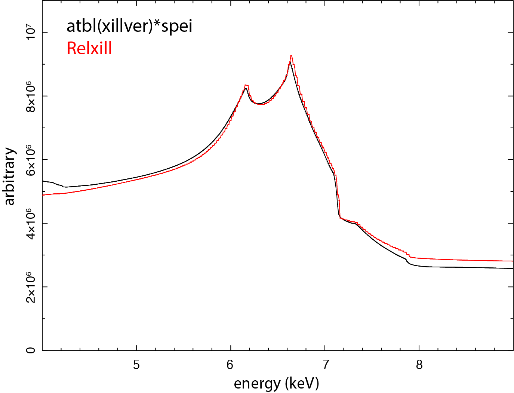

.. _sec:reflect:

SPEX solution of the relativistic disk reflection
===========================

.. highlight:: none

*By: Liyi Gu*
   
Here two sets of disk reflection setups are compared: 
`XILLVER <https://sites.srl.caltech.edu/~javier/xillver>`_ convolved with
a SPEITH line profile, and 
`RELXILL <https://www.sternwarte.uni-erlangen.de/~dauser/research/relxill/>`_.

Setup of xillver*spei
======================

The table model based on the X-ray reflection code XILLVER can be incorporated
in SPEX through atbl (:ref:`sect:atbl`)::
  SPEX> com atbl
  SPEX> par 1 1 file av /directory/to/xillver/xillverCp_v3.6.fits
  SPEX> calc

The relativistic line profile can be obtained by applying the convolution model SPEITH::
  
  SPEX> com spei
  SPEX> par 1 2 i couple 1 1 incl
  SPEX> com rel 1 2

In this way, the inclination of the SPEI component is coupled to that of the XILLVER
model, and the relativistic kernel SPEI has been applied to the XILLVER spectrum.

Validating xillver*spei using Relxill
======================
The above setup is compared with a RELXILL calculation using the same set of parameters. The
model assumes a disk with solar iron abundance around a maximally spinning black hole, with the
inner radius set to the ISCO and the outer radius fixed at 400 gravitational radii. The emissivity
index is 2, the inclination angle is 45 degree, the primary power-law photon index is 2, and the
ionization parameter is 1.

As seen in the figure, the two setups agree well for the Fe-K region. 

.. note:: Relxill model can also be incorporated in SPEX using the user model (:ref:`sect:user`). 

*Recommended citation:* `Garcia et al. (2010)
<https://ui.adsabs.harvard.edu/abs/2010ApJ...718..695G/abstract>`_

`Garcia et al. (2013) 
<https://ui.adsabs.harvard.edu/abs/2013ApJ...768..146G/abstract>`_

`Speith et al. (1995)  
<https://ui.adsabs.harvard.edu/abs/1995CoPhC..88..109S/abstract>`_
and
`Dauser et al. (2013) 
<https://ui.adsabs.harvard.edu/abs/2013MNRAS.430.1694D/abstract>`_
