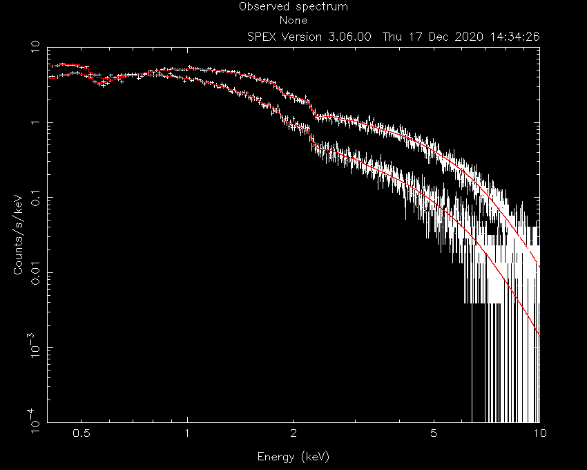

.. _sec::twospec:

.. highlight:: none

Fitting two different spectra simultaneously
============================================

Suppose one wants to fit two observed spectra from different sources (or areas on the sky) simultaneously
with two different models, but with certain parameters coupled to each other. This is possible with SPEX!
In this thread, we will guide you through the necessary steps to make this work.

Goal
----

Suppose we have two point sources absorbed by the same molecular cloud in front of them. The elemental
abundances in the cloud appear to be non-solar, but are assumed to be constant trough the cloud.
Let's say, we want to fit both sources, while we couple the abundance in the absorber. This
requires us to load two different spectra and apply two different source models to them, while
constraining some parameters between the models.

Sectors and regions
-------------------

Before we begin, it is good to understand the SPEX definitions of 'sectors' and 'regions'. These SPEX
concepts are very useful when creating more complicated fitting setups, but are often considered to be
confusing. In this context, it is also useful to know the definition of 'instruments', because this is
very close to the definition of 'region'.

| **Sectors** are used in SPEX to create multiple separate models, for example to model two different sources
  or areas of an extended source. Key is that this is a division in **model space**. Each sector is assigned
  an integer number such that each model can be identified.

| **Regions** are used in SPEX to distinguish different observed spectra, for example observed spectra from
  different sources or spectra extracted from different extraction regions on the detector. Key is that this
  is a division in **data space**. Each observed spectrum is assigned its own integer number to be identified.
  Regions are usually defined when the spectra and response are combined into one .spo and .res file.

| **Instruments** are another division in **data space**. Spectra from each .spo and .res file combination
  that are read in, are assigned an integer instrument number. Because one set of .spo and .res files can
  contain multiple regions, one can imagine a setup with multiple instruments which each a number of regions
  with an observed spectrum in them. In this analysis thread, we will only use the regions.

When fitting, SPEX needs to know which model (sector) needs to be applied to which observed spectrum (region).
This is already defined when spectra are converted to SPEX format with ``trafo``, which is explained in the next
section.

Step 1: Trafo
-------------

For this science case, we have two sets of XMM-Newton MOS spectra: ``M1_src1.pha`` and ``M1_src2.pha`` and their
respective arf and rmf files. One spectrum for each point source.

To enable that we create two distinct models for each source, we need to set the relationship between the
model sectors that we will create later in SPEX and the spectra that we read in. In this case, we want the
model in sector #1 to be fitted to the observed spectrum #1 and, obviously, the model in sector #2 fitted to
observed spectrum #2. In SPEX, this needs to be defined already in the spectral file. For this, we use the
``trafo`` program::

    Linux:~> trafo
    Program trafo: transform data to SPEX 2.0 format
    This is version 1.04, of trafo

     Are your data in OGIP format            : type=1
     Old (Version 1.10 and below) SPEX format: type=2
     New (Version 2.00 and above) SPEX format: type=3

     Enter the type: 1

In this example, we have OGIP files, so we enter ``1`` for the type. The next question is how many spectra
we want to transform and there we enter ``2``::

     Enter the number of spectra you want to transform: 2
     Enter the maximum number of response groups per energy per spectrum: 100000

Answer the next question with a large number, like ``100000``. The question after that is important for our purpose::

     Enter the number of sectors you want to create: 2

Since we want to create two separate models, we enter ``2`` here. Then we can start to load the data one by one,
while defining the relation between the model number and observed spectrum at the same time. We start with source
number 1. For this source we define that sector (model) #1 should be fitted to spectrum (region) #1::

     Enter the sector and region number: 1 1

After this, the usual ``trafo`` questions are asked about the input files. Provide ``trafo`` with the
files for source #1::

     How should the matrix be partioned?
     Option 1: keep as provided (1 component, no re-arrangements)
     Option 2: rearrange into contiguous groups
     Option 3: split into N roughly equal-sized components
     Enter your preferred option (1,2,3): 1
     Enter filename spectrum to be read: M1_src1.pha
     Exposure time (s): 1.00000000E+04
     Assuming Poissonian Errors
     Areascal: 1.00000000E+00
     Backscal: 1.00000000E+00
     Backfile:
     Corrscal: **************
     Corrfile:
     Respfile:
     Ancrfile:
     No background specified in pha-file.

     Read nevertheless a background file? (y/n) [no]:
     Checking data quality and grouping ...
     Ogip files have quality flags. Quality 0 means okay
     Your spectrum file has          0 bins with bad quality
     Your combined file has          0 bins with bad quality
     Shall we use these quality flags to ignore bad channels? (y/n) [no]:y
     Your spectrum has grouping flags. Do you want your
     Spectrum to be binned according to these groups? (y/n) [no]:n
     Determining background subtracted spectra ...
     No response matrix file specified in pha-file.
     Enter filename response matrix to be read: M1_src1.rmf
     Reading response matrix ...
     Lower model bin boundary for bin        1 must be positive; current values:   0.000000E+00  5.000000E-03
     Enter new bin boundary values manually: 3E-5 5E-3
     Warning, ebounds data started at channel    0
     Warning, response data started at channel 0
     Possible response conflict; check xspec/spex with delta line!
     Enter shift to response array (1 recommended, but some cases may be 0):1
     No effective area file specified in pha-file.

     Read nevertheless an effective area file? (y/n) [no]: y
     Enter filename arf-file to be read: M1_src1.arf
     Reading effective area ...
     Determining zero response data  ...
     Total number of channels with zero response:        0
     Original number of data channels                               :          800
     Channels after passing mask and omitting zero response channels:          800
     Rebinning data where necessary ...
     Rebinning response where necessary ...
     old number of response elements:      1280442
     new number of response elements:      1280442
     old number of response groups  :         2394
     new number of response groups  :         2394
     Correcting for effective area ...

     Determine number of components ...
     Found     1 components
     Enter any shift in bins (0 recommended): 0
     order will not be swapped ...

Now, we can do the same for source #2, but now we want model #2 to be fitted to spectrum #2::

     Enter the sector and region number: 2 2

     How should the matrix be partioned?
     Option 1: keep as provided (1 component, no re-arrangements)
     Option 2: rearrange into contiguous groups
     Option 3: split into N roughly equal-sized components
     Enter your preferred option (1,2,3): 1
     Enter filename spectrum to be read: M1_src2.pha
     Exposure time (s): 1.00000000E+04
     Assuming Poissonian Errors
     Areascal: 1.00000000E+00
     Backscal: 1.00000000E+00
     Backfile:
     Corrscal: **************
     Corrfile:
     Respfile:
     Ancrfile:
     No background specified in pha-file.

     Read nevertheless a background file? (y/n) [no]: n
     Checking data quality and grouping ...
     Ogip files have quality flags. Quality 0 means okay
     Your spectrum file has          0 bins with bad quality
     Your combined file has          0 bins with bad quality
     Shall we use these quality flags to ignore bad channels? (y/n) [no]:n
     Your spectrum has grouping flags. Do you want your
     Spectrum to be binned according to these groups? (y/n) [no]:n
     Determining background subtracted spectra ...
     No response matrix file specified in pha-file.
     Enter filename response matrix to be read: M1_src2.rmf
     Reading response matrix ...
     Lower model bin boundary for bin        1 must be positive; current values:   0.000000E+00  5.000000E-03
     Enter new bin boundary values manually: 3E-5 5E-3
     Warning, ebounds data started at channel    0
     Warning, response data started at channel 0
     Possible response conflict; check xspec/spex with delta line!
     Enter shift to response array (1 recommended, but some cases may be 0):1
     No effective area file specified in pha-file.

     Read nevertheless an effective area file? (y/n) [no]: y
     Enter filename arf-file to be read: M1_src2.arf
     Reading effective area ...
     Determining zero response data  ...
     Total number of channels with zero response:        0
     Original number of data channels                               :          800
     Channels after passing mask and omitting zero response channels:          800
     Rebinning data where necessary ...
     Rebinning response where necessary ...
     old number of response elements:      1280442
     new number of response elements:      1280442
     old number of response groups  :         2394
     new number of response groups  :         2394
     Correcting for effective area ...

     Determine number of components ...
     Found     1 components
     Enter any shift in bins (0 recommended): 0
     order will not be swapped ...

Finally, we need to provide the file names for the .spo and .res files (M1)::

     Enter filename spectrum to be saved (without .spo): M1
     Enter filename response to be saved (without .res): M1
     Final number of response elements:  2560884

We now have the observed spectra in a data file that we can use in SPEX.

Step 2: SPEX
------------

Let's first load the data into SPEX and see how they look::

    Linux:~> spex
     Welcome user to SPEX version 3.06.00

     Currently using SPEXACT version 2.07.00. Type `help var calc` for details.

    SPEX> data M1 M1
    SPEX> plot dev xs
    SPEX> plot type data
    SPEX> plot x log
    SPEX> plot y log
    SPEX> pl rx 0.4:10
    SPEX> pl ry 1E-4:10.
    SPEX> pl

.. figure:: twospec_1.gif
   :width: 600

Now, we ignore the parts of the spectra that are not well calibrated or contain too little photons::

    SPEX> ign 0.0:0.4 un k
    SPEX> ign 10:100 un k

To keep this thread focused on the method to fit two different spectra, we chose to keep the models simple.
Both sources consist of an absorbed powerlaw (with different slope and normalisation), but both absorbed
by the same molecular cloud. Now, we need to define the model for both the sectors we intent to use::

    SPEX> com hot
     You have defined    1 component.
    SPEX> com po
     You have defined    2 components.
    SPEX> com rel 2 1
    SPEX> sector new
    There are 2 sectors
    SPEX> com 2 hot
     You have defined    1 component.
    SPEX> com 2 po
     You have defined    2 components.
    SPEX> com rel 2 2 1
    SPEX> model show
    --------------------------------------------------------------------------------
     Number of sectors         :     2
     Sector:    1 Number of model components:     2
        Nr.    1: hot
        Nr.    2: pow [1 ]
     Sector:    2 Number of model components:     2
        Nr.    1: hot
        Nr.    2: pow [1 ]

The absorption by the molecular cloud is done with the ``hot`` component and the power law using ``pow``. Using
the ``model show`` command, we can see how the models are built up for each sector.

Note that in the case above, where the components in both sectors are the same, we could have used the command
``sector copy`` to copy the contents of sector #1 into sector #2. This would have saved us a couple of lines
of commands.

Let's have a look at how this shows in the ``par show`` command::

    SPEX> par show
    --------------------------------------------------------------------------------------------------
    sect comp mod  acro parameter with unit     value      status    minimum   maximum lsec lcom lpar

       1    1 hot  nh   X-Column (1E28/m**2)  1.000000     thawn     0.0      1.00E+20
       1    1 hot  t    Temperature (keV)     1.000000     thawn    2.00E-04  1.00E+03
       1    1 hot  rt   T(balance) / T(spec)  1.000000     frozen   1.00E-04  1.00E+04
       1    1 hot  fcov Covering fraction     1.000000     frozen    0.0       1.0
       1    1 hot  v    RMS Velocity (km/s)   100.0000     frozen    0.0      3.00E+05
       1    1 hot  rms  RMS blend    (km/s)   0.000000     frozen    0.0      1.00E+05
       1    1 hot  dv   Vel. separ. (km/s)    100.0000     frozen    0.0      1.00E+05
       1    1 hot  zv   Average vel. (km/s)   0.000000     frozen  -1.00E+05  1.00E+05
       1    1 hot  ref  Reference atom        1.000000     frozen    1.0       30.
       1    1 hot  01   Abundance H           1.000000     frozen    0.0      1.00E+10
       1    1 hot  02   Abundance He          1.000000     frozen    0.0      1.00E+10
       1    1 hot  03   Abundance Li          1.000000     frozen    0.0      1.00E+10
       1    1 hot  04   Abundance Be          1.000000     frozen    0.0      1.00E+10
       1    1 hot  05   Abundance B           1.000000     frozen    0.0      1.00E+10
       1    1 hot  06   Abundance C           1.000000     frozen    0.0      1.00E+10
       1    1 hot  07   Abundance N           1.000000     frozen    0.0      1.00E+10
       1    1 hot  08   Abundance O           1.000000     frozen    0.0      1.00E+10
       1    1 hot  09   Abundance F           1.000000     frozen    0.0      1.00E+10
       1    1 hot  10   Abundance Ne          1.000000     frozen    0.0      1.00E+10
       1    1 hot  11   Abundance Na          1.000000     frozen    0.0      1.00E+10
       1    1 hot  12   Abundance Mg          1.000000     frozen    0.0      1.00E+10
       1    1 hot  13   Abundance Al          1.000000     frozen    0.0      1.00E+10
       1    1 hot  14   Abundance Si          1.000000     frozen    0.0      1.00E+10
       1    1 hot  15   Abundance P           1.000000     frozen    0.0      1.00E+10
       1    1 hot  16   Abundance S           1.000000     frozen    0.0      1.00E+10
       1    1 hot  17   Abundance Cl          1.000000     frozen    0.0      1.00E+10
       1    1 hot  18   Abundance Ar          1.000000     frozen    0.0      1.00E+10
       1    1 hot  19   Abundance K           1.000000     frozen    0.0      1.00E+10
       1    1 hot  20   Abundance Ca          1.000000     frozen    0.0      1.00E+10
       1    1 hot  21   Abundance Sc          1.000000     frozen    0.0      1.00E+10
       1    1 hot  22   Abundance Ti          1.000000     frozen    0.0      1.00E+10
       1    1 hot  23   Abundance V           1.000000     frozen    0.0      1.00E+10
       1    1 hot  24   Abundance Cr          1.000000     frozen    0.0      1.00E+10
       1    1 hot  25   Abundance Mn          1.000000     frozen    0.0      1.00E+10
       1    1 hot  26   Abundance Fe          1.000000     frozen    0.0      1.00E+10
       1    1 hot  27   Abundance Co          1.000000     frozen    0.0      1.00E+10
       1    1 hot  28   Abundance Ni          1.000000     frozen    0.0      1.00E+10
       1    1 hot  29   Abundance Cu          1.000000     frozen    0.0      1.00E+10
       1    1 hot  30   Abundance Zn          1.000000     frozen    0.0      1.00E+10
       1    1 hot  file File electr.distrib.

       1    2 pow  norm Norm (1E44 ph/s/keV)  1.000000     thawn     0.0      1.00E+20
       1    2 pow  gamm Photon index          2.000000     thawn    -10.       10.
       1    2 pow  dgam Photon index break    0.000000     frozen   -10.       10.
       1    2 pow  e0   Break energy (keV)   1.0000000E+10 frozen    0.0      1.00E+20
       1    2 pow  b    Break strength        0.000000     frozen    0.0       10.
       1    2 pow  type Type of norm          0.000000     frozen    0.0       1.0
       1    2 pow  elow Low flux limit (keV)  2.000000     frozen   1.00E-20  1.00E+10
       1    2 pow  eupp Upp flux limit (keV)  10.00000     frozen   1.00E-20  1.00E+10
       1    2 pow  lum  Luminosity (1E30 W)  2.5786482E-02 frozen    0.0      1.00E+20

       2    1 hot  nh   X-Column (1E28/m**2)  1.000000     thawn     0.0      1.00E+20
       2    1 hot  t    Temperature (keV)     1.000000     thawn    2.00E-04  1.00E+03
       2    1 hot  rt   T(balance) / T(spec)  1.000000     frozen   1.00E-04  1.00E+04
       2    1 hot  fcov Covering fraction     1.000000     frozen    0.0       1.0
       2    1 hot  v    RMS Velocity (km/s)   100.0000     frozen    0.0      3.00E+05
       2    1 hot  rms  RMS blend    (km/s)   0.000000     frozen    0.0      1.00E+05
       2    1 hot  dv   Vel. separ. (km/s)    100.0000     frozen    0.0      1.00E+05
       2    1 hot  zv   Average vel. (km/s)   0.000000     frozen  -1.00E+05  1.00E+05
       2    1 hot  ref  Reference atom        1.000000     frozen    1.0       30.
       2    1 hot  01   Abundance H           1.000000     frozen    0.0      1.00E+10
       2    1 hot  02   Abundance He          1.000000     frozen    0.0      1.00E+10
       2    1 hot  03   Abundance Li          1.000000     frozen    0.0      1.00E+10
       2    1 hot  04   Abundance Be          1.000000     frozen    0.0      1.00E+10
       2    1 hot  05   Abundance B           1.000000     frozen    0.0      1.00E+10
       2    1 hot  06   Abundance C           1.000000     frozen    0.0      1.00E+10
       2    1 hot  07   Abundance N           1.000000     frozen    0.0      1.00E+10
       2    1 hot  08   Abundance O           1.000000     frozen    0.0      1.00E+10
       2    1 hot  09   Abundance F           1.000000     frozen    0.0      1.00E+10
       2    1 hot  10   Abundance Ne          1.000000     frozen    0.0      1.00E+10
       2    1 hot  11   Abundance Na          1.000000     frozen    0.0      1.00E+10
       2    1 hot  12   Abundance Mg          1.000000     frozen    0.0      1.00E+10
       2    1 hot  13   Abundance Al          1.000000     frozen    0.0      1.00E+10
       2    1 hot  14   Abundance Si          1.000000     frozen    0.0      1.00E+10
       2    1 hot  15   Abundance P           1.000000     frozen    0.0      1.00E+10
       2    1 hot  16   Abundance S           1.000000     frozen    0.0      1.00E+10
       2    1 hot  17   Abundance Cl          1.000000     frozen    0.0      1.00E+10
       2    1 hot  18   Abundance Ar          1.000000     frozen    0.0      1.00E+10
       2    1 hot  19   Abundance K           1.000000     frozen    0.0      1.00E+10
       2    1 hot  20   Abundance Ca          1.000000     frozen    0.0      1.00E+10
       2    1 hot  21   Abundance Sc          1.000000     frozen    0.0      1.00E+10
       2    1 hot  22   Abundance Ti          1.000000     frozen    0.0      1.00E+10
       2    1 hot  23   Abundance V           1.000000     frozen    0.0      1.00E+10
       2    1 hot  24   Abundance Cr          1.000000     frozen    0.0      1.00E+10
       2    1 hot  25   Abundance Mn          1.000000     frozen    0.0      1.00E+10
       2    1 hot  26   Abundance Fe          1.000000     frozen    0.0      1.00E+10
       2    1 hot  27   Abundance Co          1.000000     frozen    0.0      1.00E+10
       2    1 hot  28   Abundance Ni          1.000000     frozen    0.0      1.00E+10
       2    1 hot  29   Abundance Cu          1.000000     frozen    0.0      1.00E+10
       2    1 hot  30   Abundance Zn          1.000000     frozen    0.0      1.00E+10
       2    1 hot  file File electr.distrib.

       2    2 pow  norm Norm (1E44 ph/s/keV)  1.000000     thawn     0.0      1.00E+20
       2    2 pow  gamm Photon index          2.000000     thawn    -10.       10.
       2    2 pow  dgam Photon index break    0.000000     frozen   -10.       10.
       2    2 pow  e0   Break energy (keV)   1.0000000E+10 frozen    0.0      1.00E+20
       2    2 pow  b    Break strength        0.000000     frozen    0.0       10.
       2    2 pow  type Type of norm          0.000000     frozen    0.0       1.0
       2    2 pow  elow Low flux limit (keV)  2.000000     frozen   1.00E-20  1.00E+10
       2    2 pow  eupp Upp flux limit (keV)  10.00000     frozen   1.00E-20  1.00E+10
       2    2 pow  lum  Luminosity (1E30 W)  2.5786482E-02 frozen    0.0      1.00E+20

    Instrument     1 region    1 has norm    1.00000E+00 and is frozen
    Instrument     1 region    2 has norm    1.00000E+00 and is frozen

    --------------------------------------------------------------------------------
     Fluxes and restframe luminosities between   2.0000     and    10.000     keV

     sect comp mod   photon flux   energy flux nr of photons    luminosity
                  (phot/m**2/s)      (W/m**2)   (photons/s)           (W)
        1    2 pow   2.963082E-03  2.752802E-18  4.000000E+43  2.578606E+28

        2    2 pow   2.963082E-03  2.752802E-18  4.000000E+43  2.578606E+28

    --------------------------------------------------------------------------------
     Fit method        : Classical Levenberg-Marquardt
     Fit statistic     : C-statistic
     C-statistic       :   2929139.50
     Expected C-stat   :        64.11 +/-        16.31
     Chi-squared value :    158042.30
     Degrees of freedom:         0
     W-statistic       :         0.00

.. figure:: twospec_2.gif
   :width: 600

Obviously, the initial model parameters are quite far off. We also need to fix the hot model to a low temperature
to mimic neutral gas::

    SPEX> par 1 1 t v 2E-4
    SPEX> par 2 1 t v 2E-4
    SPEX> par 1 1 t stat f
    SPEX> par 2 1 t stat f
    SPEX> par 1 1 nh v 1E-3
    SPEX> par 2 1 nh v 1E-3
    SPEX> par 1 2 norm v 1000
    SPEX> par 2 2 norm v 1000
    SPEX> calc
    SPEX> plot

.. figure:: twospec_3.gif
   :width: 600

Now, the model spectrum is much closer to the best solution, so we can attempt a fit::

    SPEX> fit

which provides the following best fit parameters::

    SPEX> par show free
    --------------------------------------------------------------------------------------------------
    sect comp mod  acro parameter with unit     value      status    minimum   maximum lsec lcom lpar

       1    1 hot  nh   X-Column (1E28/m**2) 2.1649615E-04 thawn     0.0      1.00E+20

       1    2 pow  norm Norm (1E44 ph/s/keV)  2507.844     thawn     0.0      1.00E+20
       1    2 pow  gamm Photon index          1.496156     thawn    -10.       10.

       2    1 hot  nh   X-Column (1E28/m**2) 1.5288954E-04 thawn     0.0      1.00E+20

       2    2 pow  norm Norm (1E44 ph/s/keV)  1878.148     thawn     0.0      1.00E+20
       2    2 pow  gamm Photon index          2.292902     thawn    -10.       10.

    Instrument     1 region    1 has norm    1.00000E+00 and is frozen
    Instrument     1 region    2 has norm    1.00000E+00 and is frozen

    --------------------------------------------------------------------------------
     Fluxes and restframe luminosities between   2.0000     and    10.000     keV

     sect comp mod   photon flux   energy flux nr of photons    luminosity
                  (phot/m**2/s)      (W/m**2)   (photons/s)           (W)
        1    2 pow    156.468      1.123012E-13  1.971041E+47  1.413442E+32

        2    2 pow    41.1973      2.504328E-14  5.188680E+46  3.152038E+31

    --------------------------------------------------------------------------------
     Fit method        : Classical Levenberg-Marquardt
     Fit statistic     : C-statistic
     C-statistic       :      1334.89
     Expected C-stat   :      1306.19 +/-        49.94
     Chi-squared value :      1240.11
     Degrees of freedom:      1272
     W-statistic       :         0.00

And plot:

This fit already looks acceptable, but let's assume that we want to test if the oxygen abundance in the absorber is
consistent with solar. To do this, we can couple the oxygen abundances in the two hot models to each other::

    SPEX> par 2 1 08 couple 1 1 08
    SPEX> par 1 1 08 s t
    SPEX> fit

    SPEX> par show free
    --------------------------------------------------------------------------------------------------
    sect comp mod  acro parameter with unit     value      status    minimum   maximum lsec lcom lpar

       1    1 hot  nh   X-Column (1E28/m**2) 2.1453765E-04 thawn     0.0      1.00E+20
       1    1 hot  08   Abundance O           1.083166     thawn     0.0      1.00E+10

       1    2 pow  norm Norm (1E44 ph/s/keV)  2509.920     thawn     0.0      1.00E+20
       1    2 pow  gamm Photon index          1.496786     thawn    -10.       10.

       2    1 hot  nh   X-Column (1E28/m**2) 1.5155401E-04 thawn     0.0      1.00E+20
       2    1 hot  08   Abundance O           1.083166     frozen    0.0      1.00E+10    1    1 08

       2    2 pow  norm Norm (1E44 ph/s/keV)  1879.305     thawn     0.0      1.00E+20
       2    2 pow  gamm Photon index          2.293384     thawn    -10.       10.

    Instrument     1 region    1 has norm    1.00000E+00 and is frozen
    Instrument     1 region    2 has norm    1.00000E+00 and is frozen

    --------------------------------------------------------------------------------
     Fluxes and restframe luminosities between   2.0000     and    10.000     keV

     sect comp mod   photon flux   energy flux nr of photons    luminosity
                  (phot/m**2/s)      (W/m**2)   (photons/s)           (W)
        1    2 pow    156.456      1.122785E-13  1.970944E+47  1.413182E+32

        2    2 pow    41.1969      2.504092E-14  5.188782E+46  3.151799E+31

    --------------------------------------------------------------------------------
     Fit method        : Classical Levenberg-Marquardt
     Fit statistic     : C-statistic
     C-statistic       :      1334.81
     Expected C-stat   :      1306.19 +/-        49.94
     Chi-squared value :      1239.62
     Degrees of freedom:      1273
     W-statistic       :         0.00

The example above shows that we can couple parameters across sectors to each other and fit them. Although
this may not be a realistic science case, it shows how fitting two different spectra simultaneously can
be done and how parameters of different models can be coupled to each other.

By the way, the oxygen abundance in this example did not turn out to be significantly different from solar
when one calculates the error on oxygen::

    SPEX> error 1 1 08
     parameter          C-stat      Delta          Delta
       value            value       parameter     C-stat
    ----------------------------------------------------
      0.838682         1335.33     -0.244484        0.52
      0.594198         1336.85     -0.488968        2.03
      0.838682         1335.33     -0.244484        0.52
      0.761005         1335.70     -0.322161        0.89
      0.739144         1335.82     -0.344022        1.01
      0.741589         1335.81     -0.341577        0.99
       1.32765         1335.17      0.244484        0.36
       1.57213         1336.28      0.488968        1.46
       1.41755         1335.50      0.334387        0.69
       1.48019         1335.78      0.397026        0.97
       1.48650         1335.82      0.403330        1.00
     Parameter   1    1 08  :    1.0832     Errors:  -0.34158     ,   0.40333

